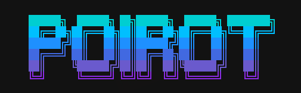

<div align="center">

<picture>
  <source media="(prefers-color-scheme: dark)" srcset="resource/poirot-logo.png">
  
</picture>

### A Deep Research Agent Kernel

[](LICENSE)
[](https://www.python.org/)
[](https://github.com/langchain-ai/langgraph)
[](https://www.deepseek.com/)

**📚 Documentation:** [English](USAGE.md) · [简体中文](resource/USAGE.zh-CN.md) · [日本語](resource/USAGE.ja.md)

<sub>ReAct Loop · Context Governance · Skill Self-Evolution · Sandbox Isolation · MCP Ecosystem</sub>

</div>

---

## Overview

Poirot is a deep research agent kernel built for those who care about **how** agents are architected. Rather than chasing a feature checklist, Poirot establishes a clean, decoupled, evaluable foundation — from the ReAct core loop to context engineering governance, from sandbox isolation to a three-layer skill self-evolution system.

Every module is independently designed, independently tested, and independently verifiable.

---

## Core Modules

### 🧠 ReAct Research Kernel

A single `LeaderAgent` orchestrates the research loop. LangGraph handles outer flow orchestration (`prepare → leader_agent → finalize`), while middleware cross-cuts every lifecycle hook: `before/after_agent`, `before/after_model`, `wrap_tool_call`. Expert mode enables the full ReAct loop with tool calling, context governance, and report generation. Default mode offers lightweight conversational responses.

### 📐 Context Engineering Governance

The `DefaultStrategy` dynamically externalizes historical messages based on a live token budget. Window size is resolved by penetrating through the `FallbackChatModel` to the active provider's real context window. Dual strategies — compaction (summarization) and externalization (offloading) — prevent context overflow in long research sessions without losing critical information.

### 🛡️ Sandbox Isolation

Two providers: **Local** (host process, for development) and **Docker** (container isolation, for production). Docker mode features a warm pool for reduced cold-start latency, idle auto-destroy, cross-process locking for concurrent instances, and automatic path translation between host and container. Agents execute `bash`, `read`, `write` inside the sandbox without polluting the host.

### 🔌 MCP Tool Ecosystem

Three transports: `stdio`, `sse`, `http`. Core tools load at startup; non-core tools defer-load on demand. Tool equivalence fallback chains (e.g., `web_search` → MCP server → builtin ddg) ensure resilience. Tool metadata drives externalization thresholds. Configured via `.poirot/mcp_servers.yaml`.

### 🎯 Three-Layer Skill Architecture

Skills are **research process knowledge bundles** — prompt-level injections, not executable functions. Poirot's skill system spans three layers:

- **Layer 1 (Base):** SQLite storage with version DAG, quality-filtered LLM hybrid selection, injection middleware, and four-counter metrics (selections / applied / completions / fallbacks).
- **Layer 2 (Evolution):** `IVEFocuser` diagnosis, `LLMMutator` variation, `ScoreDeltaGate` gating, `GitRatchet` ratchet rollback. Skills auto-evolve when effective rate drops below threshold.
- **Layer 3 (Eval):** Three-layer evaluation — execution judgment (per-skill per-task LLM), task quality scoring (4-dimension weighted), response contract checking (contract-aware rules). `RuntimeTracker` monitors applied-rate trends and feeds degradation signals back to Layer 2.

### 🎨 Dual UI

- **TUI** (default): Full-screen Textual app with a welcome view and conversation view. Left-side scrollable log, bottom input box with model info, status bar with live token usage. Wide screens show a right-side session info panel.
- **CLI** (`poirot cli`): Traditional scrolling mode with `prompt_toolkit` + `rich`. Slash-command completion and a bottom toolbar with real-time status.

### 🔄 Multi-LLM Fallback

`FallbackChatModel` constructs a role-based routing chain (researcher / reporter). On transient API failures (rate limit, timeout, 5xx), it automatically degrades to the next provider. DeepSeek always sits at the chain tail as the ultimate fallback. Supports DeepSeek, OpenAI, and Qwen out of the box.

### 📊 Observability

`RunJournal` records structured events (`skill.select`, `skill.apply`, `compaction`, `budget`). Thread directories persist run artifacts. The `/expand` command unfolds the previous round's full Thought text and tool results for debugging.

---

## Architecture

<!-- Architecture diagram placeholder — replace with generated image -->
<div align="center">


</div>

<sub>Outer flow: `prepare → before_agent → LeaderAgent (ReAct loop) → after_agent → finalize`. Middleware cross-cuts every hook. Skill injection (L1+L2+L3) happens in `before_model`. Tool calls route through Sandbox / MCP / Builtin via `wrap_tool_call`.</sub>

---

## Quick Start

```bash
# 1. Clone
git clone <repo-url> && cd Poirot

# 2. Create environment (Python 3.12+)
python -m venv .venv
.venv\Scripts\activate         # Windows
# source .venv/bin/activate    # Linux / macOS

# 3. Install
pip install -e ".[dev]"

# 4. Configure API key
cp .env.example .env
# Edit .env — fill in at least one: DEEPSEEK_API_KEY / OPENAI_API_KEY / QWEN_API_KEY

# 5. Launch (TUI by default)
poirot
```

<sub>Type a question to start researching. Type `/` for command completion, `/help` for all commands.</sub>

> **👉 For configuration, commands, Skill system, Sandbox, MCP, and troubleshooting — see the [Usage Guide](USAGE.md).**

---

## Screenshots

<!-- Screenshot placeholders — replace with actual captures -->
<table>
<tr>
<td width="50%" align="center"><b>TUI Welcome</b></td>
<td width="50%" align="center"><b>TUI Conversation</b></td>
</tr>
<tr>
<td width="50%"></td>
<td width="50%"></td>
</tr>
</table>

---

## Tech Stack

<div align="center">


</div>

---

## License

[MIT](LICENSE) © Poirot Authors

---

<div align="center">

<sub>Built for those who care about how agents are built.</sub><br>
<sub>If this project helps you, a ⭐ is appreciated.</sub>

</div>
