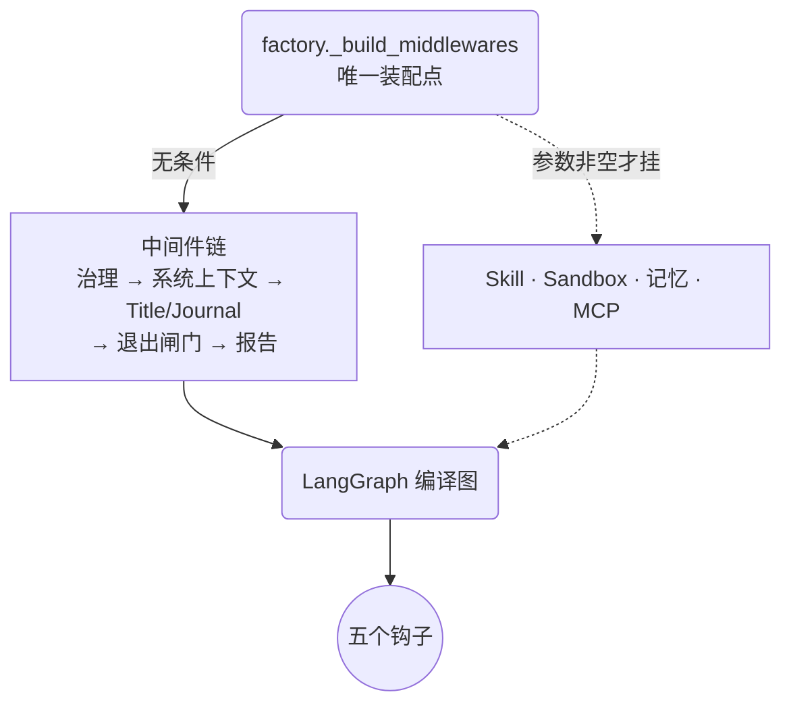
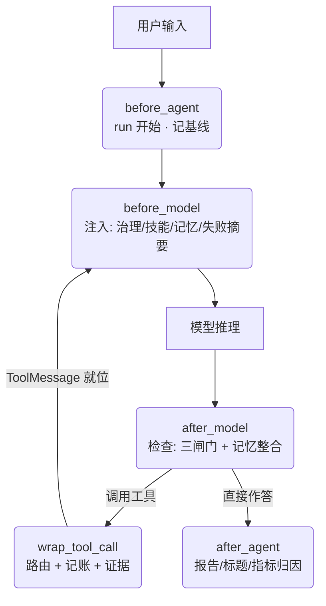
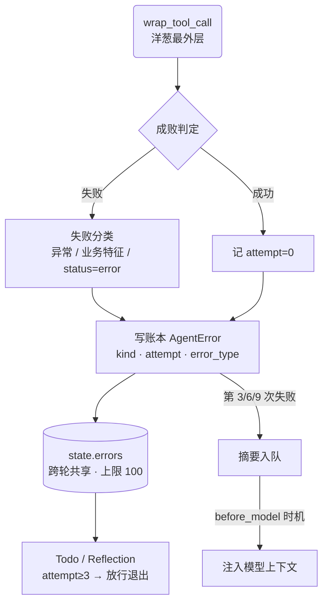
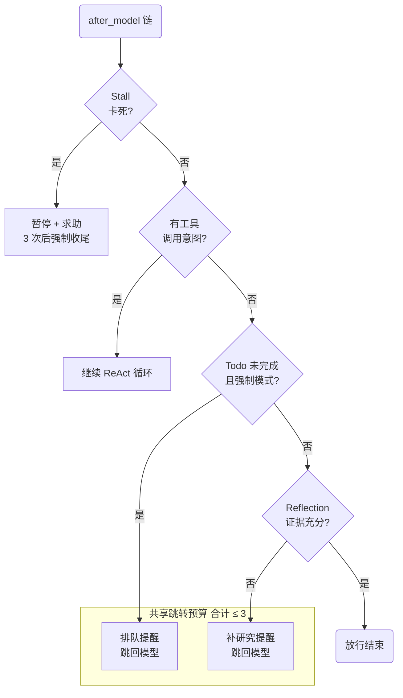
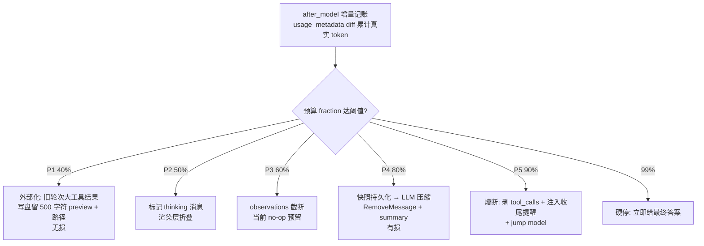
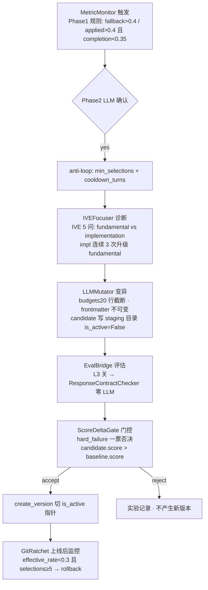
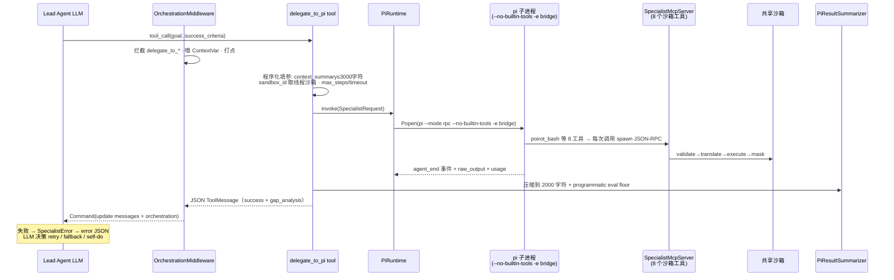
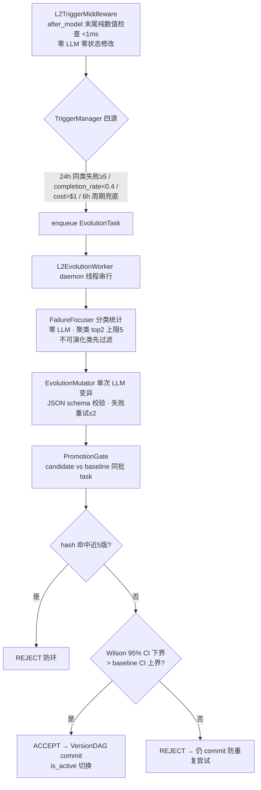
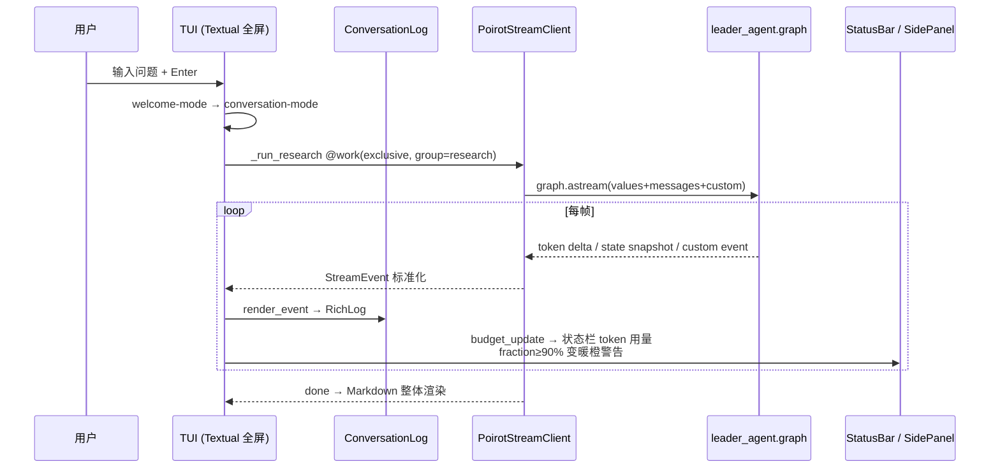

# Poirot 深度分析报告

> **Deep Research Agent Kernel with Long-Term Memory**
>
> 单作者（Hezao）在 2026-06-29 ~ 07-29 一个月内完成的个人学习/实践项目 · Python 3.12 + LangGraph 1.x + DeepSeek · MIT
> 非测试代码 33991 行（315 文件）+ 测试 35023 行（245 文件，2400+ tests）· 本地仓库 master@86bf279

---

## 目录

1. [场景化引入：深度研究 agent 的五个痛点](#一场景化引入深度研究-agent-的五个痛点)
2. [项目全景：一个把自己当成框架来写的 agent](#二项目全景一个把自己当成框架来写的-agent)
3. [竞品定位：三条赛道上各走半步](#三竞品定位三条赛道上各走半步)
4. [深度分析：一条消息的旅程](#四深度分析一条消息的旅程)
5. [评价与启发](#五评价与启发)
6. [如果重新设计](#六如果重新设计)

---

## 一、场景化引入：深度研究 agent 的五个痛点

想象你让一个 agent 完成这样的任务："调查 2026 年 AI 编程工具格局，输出带引用的深度报告"。真实运行中，你会撞上五个环环相扣的问题：

**① 上下文会爆。** 深度研究 = 几十次网页抓取 + 几十轮思考。每次搜索返回几千字符，LangGraph 默认全量重放历史——DeepSeek 的 64k 窗口通常几十个工具调用就到顶。跑到 60% 发现窗口满了怎么办？聊天可以"清空重来"，研究不行：用户投入的十几轮搜索不能白费。**需要分级治理，而不是一刀切。**

**② 记忆会蒸发。** 窗口治理只能保住单次会话。跨会话呢？用户上个月说"我经常去日本出差"，这个 agent 下个月就忘了——每个新会话都是陌生人对陌生人。**需要跨会话沉淀，且沉淀要符合记忆规律**（会过期、要复习、该分层）。

**③ 方法论不沉淀。** "如何验证一个来源""如何做系统性文献综述"——这类研究过程知识，普通 agent 每次都要靠 LLM 现场摸索。它不像代码可以版本化、回滚、评估。**需要让"怎么做"的知识像代码一样有 CI。**

**④ 能力有边界。** 研究报告里经常要"验证这段代码能跑""对实现做 review"。写代码需要 IDE 级工具面，研究模型不擅长代码——但为此再造一个多智能体框架？**需要委派，且委派要可验收。**

**⑤ 隔离与持久化打架。** agent 要执行任意命令，必须容器隔离；但 `--rm` 容器内写的文件随容器销毁而蒸发，Windows 宿主 + WSL2 Docker 的路径语义更是噩梦。**隔离不能破坏"写完的产物要能交付"这条产品线。**

市面上的开源方案（gpt-researcher、deer-flow 等）大多在"流程编排"层面回答这些问题。Poirot 的回答激进得多：**把 agent 内核本身重构成一条可插拔的管道**——ReAct 循环是薄壳，记忆、技能、沙箱、治理全部是挂在五个钩子上的中间件。README 的定位语毫不掩饰这个野心："Built for those who care about how agents are built"（为那些在乎 agent 是怎么被搭起来的人而建）。

---

## 二、项目全景：一个把自己当成框架来写的 agent

### 2.1 它是什么

Poirot 是一个**深度研究 agent 内核**：单 LeaderAgent 跑 ReAct 循环，21 个中间件横切全部生命周期钩子。外圈是双 UI（Textual TUI + prompt_toolkit CLI），内圈是七个能力模块，每个模块独立设计、独立测试、独立验证。

| 能力面 | 一句话定位 | 代码位置 |
|---|---|---|
| 上下文治理 | 分六级（P1-P5+熔断）动态外部化/压缩，防止窗口溢出 | `agents/context_engineering/` |
| 五层记忆 | schema→策略→存储→中间件→自动整合，Ebbinghaus 衰减 | `agents/memory/` |
| 三层技能 | 过程知识包 + 自进化（诊断→变异→门控→回滚）| `agents/skill/` |
| 多智能体 | 委派外部 CLI（pi/codex/claude）+ 自我副本，共享沙箱 | `agents/multiagent/` |
| 沙箱隔离 | Local/Docker 双 provider + 路径翻译 + 写路径白名单 | `agents/sandbox/` |
| MCP 工具 | 三传输 + 守卫链 + 熔断 + 回退链 | `agents/mcp/` |
| 双 UI | TUI/CLI 同源流式渲染 + RunJournal 结构化事件 | `app/` |

### 2.2 总数据流

```mermaid
flowchart TD
    U[用户输入] --> IN{IntentTree<br/>报告请求?}
    IN -->|/report| RA[ReportAction 短路处理]
    IN -->|普通问题| RS[RunManager.create_run<br/>RunContext + journal + record]
    RS --> L[LeaderAgent.run<br/>leader/agent.py 薄壳]
    L --> G[LangGraph 编译图<br/>create_agent]
    subgraph ReAct[ReAct 循环]
        G --> BA[before_agent<br/>21 中间件: 记基线/清状态/日志]
        BA --> BM[before_model<br/>注入: 治理TaggedContext→技能→记忆→失败摘要→Todo提醒]
        BM --> M[Model 推理]
        M --> AM[after_model<br/>退出闸门: Stall→Todo→Reflection<br/>+ 记忆整合(L5) + 治理记账]
        AM -->|工具调用| WT[wrap_tool_call<br/>Sandbox/MCP/Builtin 路由<br/>+ 账本 + 证据 + 审计]
        WT --> BM
    end
    AM -->|模型直接作答| AA[after_agent<br/>Report 合成 + Title + 指标归因]
    AA --> F[RunManager.mark_success<br/>journal + record.json]
    F --> UI[CLI/TUI 渲染 StreamEvent]
    G -. checkpointer 跨轮持久化 .-> L
```

三个贯穿全局的观察：

1. **LeaderAgent 只有 148 行，且没有一行循环逻辑**（[leader/agent.py:64-72](poirot/backend/agents/leader/agent.py) 自称 "Thin shell"）。ReAct 的多轮智能全在 LangGraph 编译的图内部，循环的"性格"全部由挂载的中间件决定——记忆、技能、沙箱可以单独摘掉，系统退化为更小的系统，而不是崩掉。
2. **五个钩子正好对应 ReAct 的三个时间维度**：run 生命周期（before/after_agent）、单轮推理（before/after_model）、工具执行（wrap_tool_call）。记忆、技能、沙箱这些"插件"没有一个是需要新钩子的——这本身就是框架完备性的证明。
3. **测试是设计的一部分**：245 个测试文件、35023 行测试代码，与非测试代码几乎 1:1。每个中间件独立文件独立测试，"独立验证"不是口号。

### 2.3 设计哲学（贯穿全篇的钥匙）

| 哲学 | 含义 | 全项目证据 |
|---|---|---|
| **中间件一等公民** | 横切能力全部插件化，主循环不反向依赖任何横切功能 | 21 middleware；`reporting` 用 Protocol 描述 runtime，agents 层不 import app 层 |
| **最小 LLM** | 原子操作是纯数据，LLM 只在语义需要处出现，且每处都有降级路径 | 记忆 5 原子操作零 LLM；skill 打点纯 SQL；ScoreDeltaGate 零 LLM 门控 |
| **懒计算 + 真实运行时解析** | 能推迟的计算不在后台跑；不硬编码阈值，运行时解析真实值 | Ebbinghaus 检索时算；窗口穿透 FallbackChatModel 解析真实模型容量 |
| **防御式工程** | 把"模型会犯错、框架会踩坑"当一等公民防御 | 消息配对三防线、fail-closed reducer、GitRatchet 回滚、写路径白名单、熔断器 |
| **契约先行、实现后置** | 先立 Protocol/接口，再逐步实现（本报告 5.2 将揭示这一风格的另一面） | 9 个记忆 Protocol、L2 8 组件、EvalAdapter 可插拔库 |

---

## 三、竞品定位：三条赛道上各走半步

Poirot 同时踩在三条赛道上，每条都比"全程"少走半步——这正是它的差异化。

### 3.1 深度研究 agent 赛道：内核型 vs 流程型

| 项目 | 规模 | 路线 |
|---|---|---|
| gpt-researcher | ~26.6k★ | 流程型：规划→并行研究→审查修订→写作发布，八角色流水线（LangGraph + AG2） |
| langchain-ai/open_deep_research | ~11.2k★ | LangGraph runner：plan→parallel→synthesize |
| stanford-oval/storm | ~28.1k★ | 维基百科式长文生成 |
| deer-flow | ~58.8k★ | super-agent 超长任务编排 |
| **Poirot** | 新项目 | **内核型**：ReAct 单循环 + middleware 横切，不做多角色流水线 |

核心分歧：**gpt-researcher 系把"研究"拆成固定拓扑的多角色流水线（planner/researcher/writer），Poirot 认为研究流程不该写死在拓扑里**——它让 LLM 在 ReAct 循环里自己决定下一步（软路由），把方法论交给技能系统去进化。固定拓扑确定性强、可复现；动态拓扑灵活但委派决策不可复现——Poirot 用指标计数器和 L2 演化来补偿这个代价（见 4.5）。

### 3.2 记忆赛道：Ebbinghaus 衰减是 2026 年的前沿差异化

2026 年的主流 agent 记忆框架——Mem0（~48k★）、Zep/Graphiti、Letta/MemGPT——**基本都不做数学衰减**：记忆要么在要么不在，强化靠向量相似度或 TTL 硬删。Poirot 把认知科学的遗忘曲线搬进实现：`strength = base×(1-decay)^hours + log(1+access)×0.1 + importance×0.05`，在检索时按需计算（懒计算），强度以 30% 权重参与检索排序。这与 2026 年新兴的 SuperLocalMemory V3.3、YourMemory 同向（它们的遗忘曲线论文 2026-04 才发布）——**一个个人学习项目，无意中站在了记忆系统的最前沿**。差异化的代价是：纯文件存储（单 traces.md 真相源）在千条记忆后性能堪忧，且不依赖向量库也意味着语义检索能力有限（详见 4.2）。

### 3.3 技能自进化赛道：补上"出"的机制

2026 年的技能自进化文献有一条核心结论（Library Drift 论文，2026-05）：**无治理的技能库会静默退化**——LLM 自写技能 +0.0pp，人工策展 +16.2pp；deer-flow 的 RFC #1865 也承认技能库"只进不出"是缺陷。Poirot 的三层技能系统是极少数同时实现"进"和"出"的开源实现：质量过滤（烂技能不注入）、ScoreDeltaGate 门控（LLM 变异必须过规则评审，因为 LLM 自评只有 46.4% 可信）、GitRatchet 上线后自动回滚。**它是 Library Drift 论文"Ratchet"治理思想的独立实现**——作者没有引用论文，但从工程约束推导出了同样的防线。

> 一句话总结定位：**Poirot 是"为学习而写的架构样本"——每个模块都在回答一个业界前沿问题，且给出可测试、可审计的独立解答。** 它不追求功能清单的完整，追求架构叙事的完整。

---

## 四、深度分析：一条消息的旅程

接下来的七节跟随一条消息从进入系统到最终渲染的旅程。每节的起点是上一节留下的问题：主循环撑起骨架，但上下文会爆 → 治理和记忆接住 → 但方法论不沉淀 → 技能系统接住 → 但单 agent 有边界 → 委派解决 → 但委派需要进化评估 → 闭环接住 → 但执行要安全边界 → 沙箱接住 → 最后，用户怎么用？UI 与装配收尾。

### 4.1 第一站：主循环与横切框架——一条消息如何穿过 24 个中间件

**读者带着的问题：这个系统凭什么能把记忆、技能、沙箱、上下文治理全部做成插件？**

一句话答案：**主循环是 148 行的薄壳，横切能力全部是挂在一个唯一装配点上的中间件，装配由构造参数决定、逻辑里没有一个 if。** 这一节回答三个递进的问题：中间件从哪来（装配）、挂在哪（钩子）、凭什么协同不打架（账本 + 闸门 + 防御）。

#### 4.1.1 装配点：一切从这里长出来

**答案的物理起点是 `_build_middlewares`**——全项目唯一装配点。它做的事只有一件：按固定顺序把中间件实例排进一个 list，交给 LangGraph 的 `create_agent` 编译成图。挂载顺序不是随意的，源码注释就是挂载哲学：

```
治理层（公共3 + StrategyMiddleware）→ SystemContext → SkillInjection → SkillMetrics
→ Title → RunJournal → MCP Audit → Sandbox → 记忆 → HelpRequest → DanglingToolCall
→ ToolCall → Evidence → Stall → Todo → Reflection → Report
```

**读图约定（全节通用）：** 圆角矩形 = 阶段/动作 · 菱形 = 判定 · 圆柱 = 数据存储 · 虚线 = 条件/可选关系



三个值得记住的细节：

1. **开关在装配表，不在逻辑里。** 记忆、沙箱、技能全部是"参数非空才挂"。摘掉一个能力 = 少传一个参数，**不是删一段代码**。系统退化为更小的系统，而不是崩掉。
2. **同一模块不同策略也用参数化区分。** expert_mode 不是全局 if，而是逐中间件传参：Todo 的完成度强制开关、Reflection 的判定策略（轻量 or 充分性）都在装配时选定。**default 模式和 expert 模式是同一套中间件的参数差，不是两套代码。**
3. **连"移除一个中间件"都是装配层的事。** LoopDetection（死循环熔断）被注释掉而不是删除，注释写明原因"用户要求取消循环上限约束"。防御机制与产品偏好解耦，想恢复就取消注释——这是"装配即配置"的极致形态。

| 概念 | 出处 |
|---|---|
| 装配点主体 | [factory.py:53-164](poirot/backend/agents/leader/factory.py#L53-L164) |
| 挂载顺序注释 | [factory.py:76-78](poirot/backend/agents/leader/factory.py#L76-L78) |
| 沙箱 / 记忆条件挂载 | [factory.py:107](poirot/backend/agents/leader/factory.py#L107) / [factory.py:120](poirot/backend/agents/leader/factory.py#L120) |
| expert_mode 参数化 | [factory.py:156-160](poirot/backend/agents/leader/factory.py#L156-L160) |
| LoopDetection 移除注释 | [factory.py:145-148](poirot/backend/agents/leader/factory.py#L145-L148) |

#### 4.1.2 五个钩子：骨架薄到什么程度，钩子就稳到什么程度

中间件不是随便实现的，它们统一继承 LangChain 的 `AgentMiddleware`，实现 5 个钩子协议：

| 钩子 | 时机 | 用途 |
|---|---|---|
| `before_agent` | 整轮 run 开始 | 记 errors 基线、清陈旧状态、生命周期日志 |
| `after_agent` | 整轮 run 结束 | 报告合成、标题、指标归因 |
| `before_model` | 每次模型推理前 | **注入点**：治理上下文、技能、记忆、失败摘要、Todo 提醒 |
| `after_model` | 每次模型推理后 | **检查点**：三个退出闸门（Stall→Todo→Reflection）+ 记忆整合 |
| `wrap_tool_call` | 每次工具执行 | 路由（Sandbox/MCP/Builtin）、账本、证据沉淀、审计 |



**最精妙的一条纪律：注入点全放 before_model，检查点全放 after_model。** 这是由运行时约束倒逼出来的，不是风格偏好：

- **after_model 时 ToolMessage 已全部就位。** 检测、排队、记忆整合在这里做，不会破坏消息配对；
- **before_model 注入的 HumanMessage 追加在消息尾，天然合法。** 反之，在 wrap_tool_call 里注入会把 HumanMessage 插进并行工具调用的 ToolMessage 之间——下一轮模型调用直接 400。

这个坑被完整记录在源码注释里：

```python
# failure_summary + budget_exhausted 提示用队列延迟到 before_model 注入，
# 避免在 wrap_tool_call 注入 HumanMessage 插在并行 tool_calls 的 ToolMessage 之间
# 破坏 API pairing（AIMessage(tool_calls) 后必须紧跟 ToolMessage）。
```

由此演化出 Poirot 的招牌模式——**"排队-注入"**：wrap_tool_call 只记账、把提示塞进队列，before_model 再统一取出来注入。**这是"真实运行时解析"哲学在消息格式层面的体现：不按直觉设计，按运行时约束设计。** 学到这里你应该注意到：钩子语义不是对称的，每条钩子纪律都源于一个具体的 400 错误。

> **出处：** [tool_call_middleware.py:150-152](poirot/backend/agents/middlewares/tool_call_middleware.py#L150-L152)（坑注释）· [tool_call_middleware.py:281-284](poirot/backend/agents/middlewares/tool_call_middleware.py#L281-L284)（入队）· [tool_call_middleware.py:311-319](poirot/backend/agents/middlewares/tool_call_middleware.py#L311-L319)（统一注入）· [memory_recall_middleware.py:25](poirot/backend/agents/middlewares/memory_recall_middleware.py#L25)（继承 AgentMiddleware）

#### 4.1.3 工具账本：全模块最精妙的发明

**问题：工具失败信息要跨三个维度可见。** 跨轮（checkpointer 持久化）、跨中间件（Todo/Reflection 要读"持续失败"信号）、跨 run（多轮 chat 会话）。如果每个中间件用自己的私有状态存，跨轮就断了——私有状态不随 checkpointer 持久化。

**方案：把账本写进 state。** errors 字段从"本轮错误列表"升级为"工具调用账本"，AgentError 为此扩展出 kind、tool_name、attempt、error_type、reason 五个字段：

```python
@dataclass(frozen=True)
class AgentError:
    error_id: str
    stage: str
    message: str
    related_refs: tuple[str, ...] = field(default_factory=tuple)
    created_at: str | None = None
    # F8.1：errors 升级为工具调用账本，扩展字段（带默认值兼容既有构造）
    kind: str = "failure"           # "failure" / "success"
    tool_name: str = ""
    attempt: int = 0                # 该 tool 连续失败次（成功归 0）
    error_type: str = ""            # F5 分类
    reason: str = ""                # F8.2 原因模板
```

**成败都记，成功归零**——这是账本区别于"错误日志"的关键设计。看 `_process_result`：异常记 failure、业务失败记 failure、**成功也记一条 attempt=0**。于是"per-tool 连续失败次数"不是一个计数器，而是**从 state 派生**的：从 errors 里倒着找该工具最新一条的 attempt 即可。**状态即真相，没有第二份计数器需要同步。**



这套设计的三个精妙点：

**① 失败分类是分层的。** 第一层判异常类型：超时/连接错误归为 network，API 限流归为 rate_limit，服务端 5xx 归为 server_error。第二层更隐蔽：工具"成功"返回 HTTP 200，但内容里带着 blocked、forbidden、no results 这类**业务失败特征**——拿不到数据，对研究任务同样是失败，不能放过。两层都归入统一的 error_type 字段，Todo/Reflection 读到的是可判断的信号，而不是一团错误文本。

**② per-run 计数靠 baseline 而不是清空。** 多轮 chat 里 errors 会跨 run 累积，直接数会让"禁工具"误伤下一轮。解法：before_agent 记录 errors 长度基线，所有 per-run 判断用基线之后的切片。**账本在 state（跨中间件共享），计数器在私有 dict（跨 run 隔离）**——两类状态的分工刻意不同：要共享的进 state，要隔离的留在中间件内存里。

**③ 有界化防膨胀。** reducer 只保留最近 100 条。**任何写进 state 的通道都必须回答"它会涨到多大"**——这是 state 设计的通用纪律。

账本的**消费者**验证了它跨中间件的价值：Todo 的 `_has_persistent_failures` 读 errors，发现任一工具连续失败 3 次以上就**放行退出**——工具都失败了还强制"完成所有 todo"是折磨模型。Reflection 用同一个函数。**一个信号，两个消费者，零复制。**

| 概念 | 出处 |
|---|---|
| AgentError 定义 | [types.py:121-133](poirot/backend/agents/state/types.py#L121-L133) |
| 记账主流程 | [tool_call_middleware.py:219-271](poirot/backend/agents/middlewares/tool_call_middleware.py#L219-L271) |
| 异常分类（F5） | [tool_call_middleware.py:67-88](poirot/backend/agents/middlewares/tool_call_middleware.py#L67-L88) |
| 业务失败特征 | [tool_call_middleware.py:91-97](poirot/backend/agents/middlewares/tool_call_middleware.py#L91-L97) |
| attempt 派生 | [tool_call_middleware.py:128-133](poirot/backend/agents/middlewares/tool_call_middleware.py#L128-L133) |
| baseline / 切片 | [tool_call_middleware.py:326-339](poirot/backend/agents/middlewares/tool_call_middleware.py#L326-L339) / [tool_call_middleware.py:191-196](poirot/backend/agents/middlewares/tool_call_middleware.py#L191-L196) |
| 有界化 | [reducers.py:155-158](poirot/backend/agents/state/reducers.py#L155-L158) |
| 消费者放行 | [todo_middleware.py:97-111](poirot/backend/agents/middlewares/todo_middleware.py#L97-L111) / [reflection_middleware.py:113-115](poirot/backend/agents/middlewares/reflection_middleware.py#L113-L115) |

#### 4.1.4 退出闸门：三个中间件管三件事，共享一把预算

模型何时"可以停止"是 ReAct 系统最模糊的决策。Poirot 把它拆成三个正交问题，由 after_model 链上三个中间件各自回答：

| 闸门 | 回答的问题 | 判据 | 干预方式 |
|---|---|---|---|
| **Stall** | 卡死了吗？ | 工具持续失败（与完成度无关） | 暂停 + 求助，或强制收尾 |
| **Todo** | 完成度够吗？（仅 expert 强制） | todos 有未完成项 | 排队提醒 + jump_to model |
| **Reflection** | 实质充分吗？ | todos 全完成时每步有证据覆盖 | reflection_items + jump_to model |

**三层语义刻意不重叠：完成 ≠ 充分 ≠ 不死。** 一个模型可以 todo 全绿但证据稀薄（Reflection 管）、可以一直失败但 todo 没变（Stall 管）、可以没失败但没做完（Todo 管）。



**Stall——把"卡死"翻译成可计算信号。** 卡死判定在独立的 `StallTracker`（[stall_tracker.py:67-112](poirot/backend/agents/observability/stall_tracker.py#L67-L112)），三条信号：

| 信号 | 阈值 | 含义 |
|---|---|---|
| 能力耗尽 | 同一能力（sandbox/network/docker…）5 个不同命令都失败 | 这条路走不通，不是偶然故障 |
| 错误模式重复 | 同类错误出现 5 次 | 模型在重复同一个错误 |
| Todo 停滞 | 同一 in_progress 项持续 15 轮 | 表面在跑，实际原地踏步 |

最值得学的是**成功衰减窗口**：120 秒内有过一次成功工具调用，所有停滞信号全部抑制——避免在长任务正常推进时误判卡死。**判定不是无脑阈值，是"失败信号 vs 成功事实"的博弈。**

Stall 的暂停时机同样守纪律：**wrap_tool_call 里只标记、不暂停**，等 after_model 里 ToolMessage 全部就位才真正暂停。求助上限 3 次，用尽后强制收尾。

**Todo——三层防护管"忘做、不做、拖"三件事**：
- **L1 上下文丢失检测**：todos 存在但消息里找不到 write_todos 调用 → 注入提醒（模型陷入执行忘了任务书）；
- **L2 完成度强制**：模型想退出但 todos 未完成 → 排队提醒并跳回模型，最多 2 次；
- **L3 Nag 双阈值**：距上次写 todos 5 轮以上，且距上次提醒也 5 轮以上，两个条件都满足才唠叨——第一个阈值防"忘了"，第二个防"刷屏"，**两个阈值缺一个都会变成骚扰或失明**。

**Reflection——把"充分"也交出去。** 外壳 + 可替换策略：default 模式用恒放行的轻量策略（不强制补研究），expert 模式用充分性策略。充分性策略先按关键词把问题分类（研究类/闲聊类/混合）——**闲聊问题直接放行，避免"帮我选手机"被 reflection 拖进死循环**；然后只有 todos 全完成才判充分性（未完成的留给 Todo 闸门，职责不重叠）；覆盖度判断从"每步有无证据"的规则，到交给 LLM 评估，渐进增强。

**共享 jump 预算——组合系统需要组合级治理。** 如果没有共享预算，Todo 提醒→模型重跑→Reflection 提醒→模型重跑会形成**双重强制死循环**。`_jump_budget` 把两个闸门的跳转合计钉死在 3 次：

```python
def try_consume(runtime: Runtime, max_total: int = _MAX_TOTAL_JUMPS) -> bool:
    """原子地检查+消费一次跳转预算。True=已消费（预算可用），False=已耗尽。"""
    k = _key(runtime)
    with _lock:
        n = _counts.get(k, 0)
        if n >= max_total:
            return False
        _counts[k] = n + 1
        return True
```

Todo 跳转前消费预算，Reflection 同样，run 结束时统一清除。**单独看每个闸门都合理，合起来必须有限额——这是"组合系统需要组合级治理"的微型缩影，也是你在自己项目里最容易漏掉的一层。**

> **出处：** [stall_tracker.py:67-112](poirot/backend/agents/observability/stall_tracker.py#L67-L112)（三条信号）· [stall_tracker.py:90-92](poirot/backend/agents/observability/stall_tracker.py#L90-L92)（成功衰减窗口）· [stall_detection_middleware.py:56-64](poirot/backend/agents/middlewares/stall_detection_middleware.py#L56-L64)（只标记不暂停）· [stall_detection_middleware.py:157-172](poirot/backend/agents/middlewares/stall_detection_middleware.py#L157-L172)（after_model 暂停）· [stall_detection_middleware.py:123-155](poirot/backend/agents/middlewares/stall_detection_middleware.py#L123-L155)（强制收尾）· [todo_middleware.py:176-184](poirot/backend/agents/middlewares/todo_middleware.py#L176-L184)（Nag 双阈值）· [todo_middleware.py:274-279](poirot/backend/agents/middlewares/todo_middleware.py#L274-L279)（上限+jump 预算）· [reflection_middleware.py:55-125](poirot/backend/agents/middlewares/reflection_middleware.py#L55-L125)（双策略）· [reflection_middleware.py:84-92](poirot/backend/agents/middlewares/reflection_middleware.py#L84-L92)（问题分类）· [_jump_budget.py:26-34](poirot/backend/agents/middlewares/_jump_budget.py#L26-L34)（预算实现）· [todo_middleware.py:351](poirot/backend/agents/middlewares/todo_middleware.py#L351)（run 结束清除）

#### 4.1.5 消息配对三防线：把 LLM 的不确定性当一等公民

**背景知识：LangGraph 的配对约束。** `AIMessage(tool_calls=[...])` 之后必须紧跟对应的 `ToolMessage`，否则下一轮模型调用直接 400，**一次断裂整条任务报废**。中断恢复、暂停、异常——三种场景都会制造悬挂的 tool_calls。Poirot 有三条防线，各守一个时机：

```mermaid
flowchart LR
    A[暂停/中断后恢复<br/>历史带悬挂 tool_calls] --> B[DanglingToolCall<br/>before_model 补占位]
    C[Stall 跳 END 前] --> D[Stall 补 [Skipped] 占位]
    E[工具执行抛异常] --> F[ToolCall 合成<br/>error ToolMessage]
    B --> OK[(checkpointer<br/>历史永远配对完整)]
    D --> OK
    F --> OK
```

- **防线① DanglingToolCall**：before_model 扫描全部历史，收集已应答的 tool_call_id，给悬挂的补占位 ToolMessage。注意 docstring 里写着 "Borrowed from deer-flow DanglingToolCallMiddleware pattern"——诚实标注借鉴来源，是值得学习的开源习惯；
- **防线② Stall 暂停前补全**：跳 END 前扫历史补 [Skipped — stall detected] 占位——否则下一次恢复会话时 checkpointer 恢复出悬挂调用，立刻 400；
- **防线③ ToolCall 异常合成**：handler 抛异常时合成 status=error 的 ToolMessage，连"返回值为空"这种边界也补空 ToolMessage。

> **出处：** [dangling_tool_call_middleware.py:51-79](poirot/backend/agents/middlewares/dangling_tool_call_middleware.py#L51-L79) · [dangling_tool_call_middleware.py:9](poirot/backend/agents/middlewares/dangling_tool_call_middleware.py#L9)（deer-flow 来源标注）· [stall_detection_middleware.py:93-114](poirot/backend/agents/middlewares/stall_detection_middleware.py#L93-L114) · [tool_call_middleware.py:243-249](poirot/backend/agents/middlewares/tool_call_middleware.py#L243-L249) · [tool_call_middleware.py:277-279](poirot/backend/agents/middlewares/tool_call_middleware.py#L277-L279)

**三道防线守住同一个不变量：checkpointer 存下的历史永远格式良好。** 这是"防御式工程"哲学在消息层的实例——**不是假设模型不会犯错，而是假设它一定会犯错，然后在每个断裂点预备一条出路。**

#### 4.1.6 与业界对比：Poirot 站在哪、多走了哪半步

- **deer-flow**（明确借鉴对象）：借了 checkpointer 单例、悬空修补、循环检测等模式，但把 deer-flow 的"主循环内嵌逻辑"升级为 middleware 化——**这是从"单体"到"可插拔"的架构跃迁**。用架构术语说：deer-flow 的横切逻辑是编译期缝合的，Poirot 是运行时装配的；
- **LangGraph 1.x**：Poirot 是第一批把 AgentMiddleware 当主架构用的项目。框架提供机制（五个钩子），**但不提供跨中间件协同**——顺序、预算、状态生命周期全是 Poirot 自己补的。这提醒我们：**框架只给钩子，不给纪律；纪律是应用层的事**；
- **Koa 洋葱模型**：wrap_tool_call 链是同构的洋葱（ToolCall 最外看到全部结果），但 LangChain 没有 Koa 的 next() 穿越能力——**Poirot 用"排队-注入"模式弥补**。这是一个比"硬造 next()"更务实的替代方案：与其对抗框架模型，不如顺着它的时序约束设计自己的数据流。

一个诚实的代价：LoopDetection 移除 + 重试预算放宽到 999 之后，**纯 token 消耗型死循环（每次成功但无进展）目前缺乏检测**——产品偏好（不打断长任务）压过了防御完备性，这是刻意取舍，不是疏漏。

> **出处：** [factory.py:145-148](poirot/backend/agents/leader/factory.py#L145-L148)（LoopDetection 移除）· [tool_call_middleware.py:26-27](poirot/backend/agents/middlewares/tool_call_middleware.py#L26-L27)（预算放宽）

**章节遗留问题：** reducer 只能保证"合并正确"，不能保证"上下文不爆"。循环每跑一轮，messages/observations 都在膨胀——谁能观察 token 用量、谁决定压缩？→ 下一站：上下文治理。

### 4.2 第二站：上下文治理 + 五层记忆——先别撑爆，再记住

**读者带着的问题：上下文会无限膨胀，治理不了就崩；就算治理了，跨会话的知识怎么办？**

#### Part A 上下文治理：分六级执行的"安全阀"

上下文工程是主循环的安全阀。ReAct 循环每转一圈往消息列表追加几千 token 的搜索结果，LangGraph 没有内置上下文管理——窗口一满，API 直接 400，整条研究任务报废。**研究任务不可中断**：跑到 60% 不能清空重来，所以治理必须分优先级保住"研究进程"（question/todos/observations），牺牲"研究产物"（原始工具结果），最后熔断收尾而不是崩掉。

**六级分段阈值（80/20 原则的治理版）**——与其在窗口满时一次性大扫除，不如在 fraction 爬到阈值时逐级触发由轻到重的动作：



三个执行细节值得展开：

1. **预算分母是真实模型窗口，不是配置里的 128k。** `resolve_window_size`（[utilities.py:164](poirot/backend/agents/context_engineering/utilities.py)）穿透 `FallbackChatModel` 剥到当前活跃 provider 的真实 ChatModel（再剥 `bind_tools` 后的 `.bound`），前缀匹配窗口表。**降级到 qwen 时治理自动改用 131k 窗口计算**——这是"真实运行时解析"的教科书案例。
2. **延迟一轮执行**：预算更新在 after_model（本轮结束），治理动作在下一轮 before_model 触发——保证 compaction 不在工具结果还在路上时就动手。
3. **配对保护是硬约束**：P4 的切点 `_snap_to_pairing` 保证不把 ToolMessage 拦腰截断；P5 剥 tool_calls 时复用原消息 id 替换而非追加。P1 外部化有间隔抑制（fraction 涨够 10% 才重扫），防每次模型调用都同步写盘。

**双策略设计**：外部化（无损，P1 优先）先于压缩（有损，P4 兜底）——"能用无损方案绝不用有损方案"。压缩前的全量消息 + state 存 JSON 快照（`.poirot/snapshots/`），agent 可通过 `read_snapshot` 工具读回细节——"压缩后还能问快照"。

#### Part B 五层记忆：Ebbinghaus 衰减的完整数学建模

上下文治理解决"一次会话内"，记忆解决"跨会话"。五层架构（L1 契约 → L2 策略 → L3 存储检索 → L4 中间件 → L5 自动整合 → L6 扩展预留）有一条贯穿的设计哲学：**工具无 LLM**。

> 记忆的 5 个原子操作（Encode/Retrieve/Associate/Consolidate/Reconsolidate）是**纯数据操作**——LLM 生成的内容由外部传入，LLM 编排只存在于 middleware 和 worker。对比 Mem0：它的 `add` 内部跑 LLM（提取事实 + 生成 embedding），是慢操作，无法在循环热路径调用；Poirot 的 encode 是纯内存操作（hash + 写文件），热路径可用，慢的 LLM 部分隔离到后台线程。

**Ebbinghaus 公式的三项设计**（[decay.py:39-72](poirot/backend/agents/memory/strategies/default/decay.py)）：

```
strength = base × (1-decay)^hours + log(1+access) × 0.1 + importance × 0.05
```

- **衰减项** `(1-decay)^hours`：指数衰减对应遗忘曲线。type 参数拉开差距——episodic 半小时掉一半（0.7×0.9^12≈0.22），semantic 一天几乎不掉（0.8×0.98^24≈0.49），procedural 几乎不衰减。正好对应"事件细节快速模糊、提炼知识长期稳定"。
- **强化项** `log(1+access)`：对数让复习收益递减——前几次访问强化明显，第 20 次和第 21 次趋近于零。**衰减的指数形式 + 强化的对数形式**，是个人 agent 记忆系统里少见的完整数学建模。
- **重要性加成**：LLM 评估的重要事实获得强度地板，防止被衰减到遗忘线以下。

**懒计算是正确性选择而非性能选择**：后台衰减任务的"当前时间"是任务执行时刻，可能晚于实际访问时刻数小时，导致强度被低估（用户刚复习过，任务却按 3 小时前衰减）。retrieve 时计算永远拿到 now 的精确值。

**记忆生命周期**（两个方向）：

```mermaid
flowchart TD
    subgraph Phase1[Phase 1 被动召回 · before_model]
        A[提取最后用户消息作 query] --> B[BM25 候选 + forgotten 过滤]
        B --> C[lazy decay 算 strength + min_strength 过滤]
        C --> D[复合分数 top_k<br/>score = similarity×0.7 + strength×0.3]
        D --> E[1A 强化写回<br/>strength 更新 + access_count+1]
        E --> F[token_budget 裁剪<br/>注入 per-call HumanMessage<br/>hide_from_ui=True]
        F --> G[recalled_memories 索引<br/>只存 id+score+strength]
    end
    subgraph Phase2[Phase 2 主动沉淀 · aafter_model]
        H{每 N 轮?} -->|是| I[submit MemoryTask 非阻塞]
        I --> J[MemoryWorker daemon 线程]
        J --> K[LLM 抽取 episodic<br/>manager.encode 逐个<br/>content hash 去重]
        K --> L[候选 ≥N → LLM 合并最旧 max=10 条]
        L --> M[旧 trace 标记 forgotten<br/>不删除 · 保留回滚]
    end
```



两个关键决策：

1. **记忆注入用 per-call HumanMessage 而不是 system prompt**（[memory_recall_middleware.py:97-105](poirot/backend/agents/middlewares/memory_recall_middleware.py)）——记忆内容逐轮变化，若拼进 system prompt，每轮请求的 prompt 前缀都不同，**prompt cache 全部失效**（按 token 缓存的计费模式下这是纯成本）。`recalled_memories` 状态字段只存索引不存内容，防止缓存前缀被污染。
2. **单文件 traces.md 真相源 vs SQLite/向量库**——选 Markdown 的理由：**人类可读 + git 可 diff**。用户打开 traces.md 就能检查 agent 记住了什么。代价全部写进 L3 不变量：无事务、全量重写（O(N) 写放大）、单进程锁。`batch_update` 的引入（F2 决策）就是意识到 consolidate 标记 N 条旧 trace 会触发 N 次全量重写 O(N²) 后的补救。

**BM25 为什么够用**：个人使用量级（几十到几百条）下，倒排索引全内存 O(1) 查询，命中率对"用户偏好/项目背景"这类关键词密集的记忆足够；向量检索的收益在 10k+ 记忆才显现。HybridRetriever 的"混合"体现在**叠加位**——VectorStore/GraphStore 是 optional 的 derived shadow index（L6 空壳），未来启用时各路由召回再融合，而不是现在就背上 embedding 运维。

#### 本章的已知问题（详见第 5 节）

- **MemorySink 契约无实现方**：治理层压缩丢弃消息前可调 `flush()` 沉淀进记忆，但全项目 grep 只有 `contract.py:89` 的 Protocol 定义——闭环未打通；
- **中文分词缺失**：BM25 用空格分词，中文记忆会被切碎（"下周一"变三个 token）；
- **写放大**：retrieve 强化写回每命中一条就全量重写 traces.md（top_k 命中 × O(N)）。

**章节遗留问题：** 记忆是被动检索的"事实"，但研究过程中的方法论（怎么搜、怎么组织证据、怎么收敛）是主动沉淀的"方法"——记忆解决不了"怎么做"。→ 下一站：技能系统。

### 4.3 第三站：三层技能系统——唯一会自己改进自己的模块

**读者带着的问题：研究过程知识（方法论）怎么像代码一样有版本、可回滚、可评估？**

技能系统的核心界定：**技能 = 研究过程知识包（prompt 级注入），不是可执行函数。**"如何验证一个来源"是技能，"执行网络搜索"是工具——动作性能力进工具面，过程性知识进技能面。36 个内置技能（5 类，core 12 个启动自动加载），多数标注 "Adapted from deer-flow (MIT)"——内置库的策展策略是"改编已验证的公开技能而非自创"，与 Library Drift 论文"人工策展优于 LLM 自写"的结论方向一致。

#### L1 存储：内容/索引分离 + 版本 DAG

SQLite 只存 `path + content_hash + 元数据 + 4 计数器`，SKILL.md 全文留文件（source of truth）。**版本间迁移的本质是文件复制**：新版本是 staging 目录写出的新 SKILL.md，`create_version` 只是"INSERT 新行 + UPDATE is_active 指针 + INSERT lineage_parents"三个 SQL——内容演进与状态演进解耦，回滚零拷贝。回滚 = 切 is_active 指针（类比 git revert，禁 reset --hard），**旧版本永不删除，历史永远在**。

四计数器是技能质量的全部数据基础，`effective_rate = completions/selections` 是唯一"端到端"指标：

| 计数器 | 语义 | 打点时机 |
|---|---|---|
| selections | 注入即 +1 | before_model（确定性，无争议）|
| applied | 工具命中 allowed_tools 或 L3 LLM 判定应用 | wrap_tool_call / L3 异步 |
| completions | applied 且整轮任务完成 | after_agent run 级归因 |
| fallbacks | applied=False 且任务失败 | after_agent |

设计精妙处：**completion 的 run 级归因使"技能质量"与"任务质量"解耦**——任务失败可能是环境问题，但"选了这个技能且任务失败"的联合事件仍是有信号的（四个计数器恰好构成选了/没选 × 成了/没成的 2×2 混淆矩阵的边际和）。

#### L2 进化：五段式闭环 + 四道防线



四道防线对应四种失败模式：触发太频繁（min_selections + cooldown_turns 数据驱动冷却）、变异太大胆（budget 截断 + frontmatter 不可变异）、门控太宽松（hard_failure 一票否决 + **LLM 自评被明确否决**——"SkillLens 46.4% 不可靠"，score_delta_gate.py:4 注释）、上线后无人看管（GitRatchet 持续监控自动回滚）。

**核心洞见：门控用规则、反馈用 LLM、监控用统计**——变异评审不需要"任务跑得好不好"的证据（那是上线后才能确认的），只需"文本没改坏"；所以门控端是零 LLM 的纯规则，避免了"LLM 自评自己的变异"这个经典回归。

#### L3 评估：三通道回答三个不同的问题

| 通道 | 回答什么 | 判定方式 |
|---|---|---|
| 执行判定 | 技能有没有被真用 | LLM 判定（比 middleware 的"工具名匹配"粗粒度打点更准，回写修正计数器）|
| 任务质量 | 任务做得好不好 | LLM 4 维加权（completion 0.50 / quality 0.35 / efficiency 0.05 / tool 0.10）|
| 响应契约 | 技能文本本身合不合规 | **零 LLM 程序化检查**——contract-aware 编译：扫技能文本关键词自动编译适用规则（提到"引用来源"才检查 must_cite），外部技能零改造 |

再加一个趋势层：RuntimeTracker 把 SkillJudgment 历史分前后两半比较 applied_rate 差值（`delta > +0.15 → improving`，`< -0.15 → degrading`，judgments < 4 判 insufficient_data）——**自比较**对任务分布漂移有部分免疫，是业界少见的设计。degraded 信号喂给 GitRatchet 做回滚。

#### 与业界对比

- **deer-flow RFC #1865**：用 LLM 扫描创建技能但**没有门控与回滚**——技能只进不出。Poirot 的 ScoreDeltaGate + GitRatchet 恰好补上"出"的机制：进化必须是双向的（accept + reject + rollback）。
- **OmniAgent**：Skill Self-Evolution 用同任务重放验证修复；Poirot 用 programmatic 契约检查 + 上线后统计监控替代重放——零 LLM 成本且不依赖任务可重放性，这是深度研究场景（任务不可重放）下的务实替代。
- **Library Drift 论文（2026-05）**：Poirot 的回应是三层对应——响应契约检查 = 静态治理（防变异写坏）；执行+任务判定 = 动态治理（防线上劣化）；RuntimeTracker + GitRatchet = 自动止损。**论文的"治理"是人工策展流程，Poirot 把治理自动化成三层管道。**

**章节遗留问题：** 技能让单 agent 更强，但单 agent 的能力边界是物理的——写代码需要 IDE 级工具面，研究模型不擅长代码。→ 下一站：多智能体编排。

### 4.4 第四站：多智能体编排——黑盒委派 + 共享沙箱

**读者带着的问题：能力不够时怎么办？再造一个多智能体框架？**

Poirot 的回答是**承认外部 coding agent 已经存在且更专业**（pi/codex/claude 都是成熟独立 agent，自带模型和 ReAct loop），自己只做四件事：发现它们（凭证）、给它们任务（goal + context_summary）、给它们工作台（共享沙箱）、把结果压缩回来（summarizer + programmatic eval）。10 条 INVARIANT 钉死了这个边界（[multiagent/__init__.py:1-34](poirot/backend/agents/multiagent/__init__.py)）：

> INV#1 黑盒——不管理 specialist 内部 context · INV#2 自带 model——只发现凭证 · INV#3 共享线程沙箱 · INV#4 leaf role 不能 spawn · INV#6 失败转 error ToolMessage 维持配对 · INV#8 凭证不进 LLM 主态 · INV#10 programmatic eval floor

**多智能体系统的边界在哪？** Poirot 选了"黑盒委派 + 单向数据流"而非"共享心智"：数据流只有两条——进去的是 goal+context，出来的是压缩后的 result+artifacts 引用，中间通过共享沙箱做物理数据交换。

#### 委派全链路（以 pi 为例）



三个关键设计：

1. **LLM 只填 3 个参数（goal/success_criteria/sandbox_id），其余全部程序化注入**。context_summary 由 ContextSummarizer 从 ThreadState 提取（rule-based 零 LLM 成本，self-copy 例外用 LLM），max_steps/timeout 来自 config，artifacts_path 从 state 取——**LLM 不可控的参数全部程序化**。
2. **程序化 eval floor（INV#10）**：ResultSummarizer 压回结果前做三道程序化检查——raw_output 非空、无敏感改动（`rm -rf /` 正则黑名单）、artifacts 非空；失败时 gap_analysis 必填 + 启发式失败分类（为 L2 FailureFocuser 供料）。各 specialist 叠加专业判据：Codex 解析测试通过率（0 passed 判失败）、Pi 解析三段结构（What You Did/Success/Gaps）、Claude 必须出现建议词。**诚实的技术评价**：这是"启发式地板"而非"语义裁判"——success_criteria 的文本从未被程序化校验，真正的语义判断发生在 lead agent 读 summary 后的下一步决策。**因为你控制不了执行，所以你必须在出口严格验收。**
3. **共享沙箱 = 数据总线**：specialist 的每次文件操作都经 SpecialistMcpServer（一个 stdio MCP server 暴露 Sandbox 类的 8 个公开方法）走与 lead 相同的 validate→translate→execute→mask 管线；`--sandbox-url` passthrough 让 specialist 直连 lead 的 Docker 容器，写入落同一挂载区——**外部 agent 写文件，lead 立即可见**。pi 侧更进一步：`--no-builtin-tools` 禁掉 pi 原生工具，外部 agent 没有绕过安全层的第二路径。

**Subagent（自我副本）**：与 specialist 完全同构，差异只在 runtime——进程内直接调 agent_factory 造一个 leaf-role lead agent（全新 ThreadState，不继承父 messages/observations/sources，只带 goal + context_summary + sandbox_id）。**隔离上下文、共享沙箱**；leaf role 剪枝（不挂 orchestration middleware 和 specialist tools）从构造上杜绝无限递归。`SandboxMiddleware.abefore_model` 从 `state["sandbox"]` 恢复 ContextVar 是共享沙箱的机制核心——subagent 复用父 sandbox_id，跳过 acquire。

**凭证分层**（"只发现，不管理"）：读各 CLI 自己的登录态文件（~/.claude/.credentials.json、~/.codex/auth.json、~/.pi/agent/auth.json），凭证只进 runtime 的 env，永不进 ThreadState。PiCredentialProvider 的 provider 优先级表有个有趣细节：**国内 provider 排前面**（deepseek/kimi/minimax），注释直白写着"国内 provider 优先（便宜优先）"——作者是国人、面向 DeepSeek 生态。

**与业界对比**：
- **Claude Code subagent**：概念同源（隔离上下文 + leaf role），但 Poirot 把 subagent 与外部 CLI 放进**同一接口**（LLM 不需要知道"这是我自己还是别人"），并把共享沙箱提升为显式机制。差距：Claude Code 有预算/并行控制，Poirot L1 是全量字符串回传。
- **gpt-researcher 八角色流水线**：固定拓扑（planner→researcher×N→writer），Poirot 是动态拓扑——LLM 自己决定委派给谁（soft routing）。固定拓扑可复现可评测，动态拓扑灵活但委派决策不可复现——这正是 metrics 四计数器 + L2 演化要解决的问题。

**章节遗留问题：** 委派出去的是智能体，智能体的行为质量谁来保证、怎么持续改进？→ 下一站：进化与评估闭环。

### 4.5 第五站：进化与评估闭环（L2 Evolution + L3 Eval）

**读者带着的问题：委派出去的任务质量靠什么保证？专才的表现怎么持续改进？**

L2/L3 是 multiagent 编排的"质量闭环"：L1 解决"谁能干活"，L2 解决"干得不好怎么改"，L3 解决"改得好不好怎么度量"。它们是技能系统五段式进化闭环在 multiagent 领域的**同构复刻**——同样的 trigger→focus→mutate→gate→version，但演化对象从"技能的 markdown 指令"换成"specialist 调用前的 context 生成模板与 skill 注入模板"（结构化 dataclass 而非文本）。

#### 核心立场：只演化 per-call 产物，不演化 Router

L2 明确不演化 Router（Router 就是 LLM 自己），只演化**不进 system prompt cache prefix 的 per-call 产物**：`ContextSummaryTemplate`（context 怎么生成）和 `SkillInjectionTemplate`（怎么给 specialist 注入技能）。这个边界选择极精妙：演化产物每次调用都重建（`get_active` 每次查 DB 不缓存，hot swap 生效即时），但又不破坏 prompt cache——**演化成本为零而生效即时**。

#### 进化闭环：四层防线逐层收紧



**四层防线**（任何一层失败都保持旧 is_active——"不演化 = 最保守的演化"）：
- **预算防线**：BudgetGuard 三维度记账（tokens/cost_usd/calls）per-day UTC0 重置；超限通过 tool 返回 `BudgetExceeded` JSON 让 LLM fallback lead——**预算信号作为工具输出而非系统指令回流**，不污染 prompt cache；
- **触发防线**：四源纯数值 + 1h 冷却防抖——触发判定零 LLM（INV-4），L1 turn 延迟零感知；
- **变异防线**：单次 LLM 调用 + 重试带 error_hint + schema 校验；
- **门控防线**：candidate 与 baseline 在**同一批 task 上各跑一遍**（配对对比，消除任务难度偏差），Wilson 95% CI（z=1.96，小样本友好、p=0/1 不退化）——"CI 下界 > baseline CI 上界"要求变异效果超过统计噪声；hash 命中近 5 版 REJECT 防 LLM 原地打转。

#### L3 评估：三个 adapter 覆盖三种不可互替的语义

| Adapter | 回答什么 | 何时用 |
|---|---|---|
| ProgrammaticAdapter | 任务做没做成（布尔）| 确定性 floor，零 LLM 成本 |
| LLMJudgeAdapter | 做得好不好（4 维加权）| 开放任务没有明确 success_criteria 时 |
| LongitudinalPairsAdapter | 新模板比旧模板好不好（配对 + Wilson CI）| 变异有效性判定 |

Bridge 按 ctx 特征自动降级选择（hint > 全有 expected_outcome > open_ended > programmatic），异常一律 fail-closed（success=False → L2 reject）——**评估失败退化为"不进化"，从不冒险**。L3 自设"不演化"边界（L3 不演化，防止评估器自身漂移导致无限递归到 L4）——**进化系统必须留一个人工能介入的"评估器固定点"**，这是模块架构最清醒的一笔。

**DecisionLog**（跨 run 的失败记忆）：每次 specialist 调用异步持久化（fire-and-forget 不阻塞 turn），lessons 作为变异 prompt 的输入样本——**历史教训影响"怎么变异"，不污染"怎么执行"**。

**闭环反馈**：L3 RuntimeTracker 算 SpecialistHealthReport（completion_rate/avg_cost/trend），发现 degraded（completion_rate<0.4 且 invoked≥5）后向 L2 cron queue 投递信号——L3 不知道 L2 的触发内部，只向队列投递元组，解耦干净。

#### 与业界对比

- **Library Drift 论文（2026-05）的 Ratchet 处方**：Poirot 独立实现了同一思想的三个变体——ScoreDeltaGate（上线前统计门控，变异必须先赢再上）+ VersionDAG 可回滚（上线后随时切回旧版）+ hash 防环（反原地打转）。且 reject 的候选也落库（防 LLM 下次再生成同样的废案）。
- **DSPy/GEPA 的 prompt 进化**：DSPy 用编译搜索（多种子 prompt + 评分器）做离散优化；Poirot 的 LLMMutator 更朴素（单次生成 + schema 校验 + 重试）。**但 Poirot 的差异化价值在门控不在变异**——DSPy 系假设"评估器固定可靠"，Poirot 显式区分三种评估语义并规定"L3 不演化"，这是进化系统工程化的关键一步。
- **SAGE/OmniAgent**：进化单位是"完整 agent"；Poirot 的进化单位更细（context 生成模板/skill 注入模板），风险面更小、回滚更精确——不改 agent 本体，只改"agent 看到什么"。

#### 已知的占位（重要，详见 5.2）

MVP 阶段几处实装缺位：worker 里 task_sample 传空列表 + gate 无 evaluator——**门控实际退化为"hash 防环 + 直接拒绝"**（decide 对 success=False 返 FAILED 保持旧 is_active），闭环"堵死"而非"运行"；version_dag 注入 tools.py 但 handler 未调 get_active（消费侧未实装）；两个 CLI（evolution/eval）全部 NotImplementedError（"等 dashboard/TUI"）。

**章节遗留问题：** 智能体执行任务要用工具、写代码，这些操作需要安全边界；委派出去的 specialist 也要操作文件。→ 下一站：沙箱隔离。

### 4.6 第六站：沙箱隔离 + MCP 工具生态——执行要安全，安全不能破坏交付

**读者带着的问题：agent 要执行任意代码/命令，如何隔离？隔离之后文件怎么持久化、怎么交付？**

工具面分成三条路：**Sandbox**（bash/read/write 等 6 工具，动手能力）、**MCP**（外部工具生态）、**Builtin**（ddg 搜索等兜底）。本节的完整故事是"工具调用沙箱化"：`wrap_tool_call 路由 → SandboxMiddleware 生命周期 → provider acquire → Sandbox 编排（validate → translate → execute → mask）→ 释放`。

#### 方案 C：一个具体类组合三个可替换 Protocol

sandbox/__init__.py 记载了方案演进——方案 A 每个实现各写一个完整 Sandbox 子类（编排逻辑重复 N 份），方案 B 抽象基类带默认实现（默认实现易被当摆设），最终方案 C：

```
Sandbox（唯一编排：validate → translate → execute → mask）
 ├─ SandboxRuntime   裸执行（exec/read/write），不知路径、不做安全
 ├─ PathTranslator   虚拟路径 ↔ 物理路径（含 mask_output 逆操作）
 └─ SecurityGuard    白名单 + 路径穿越拒绝（只 validate，不碰输出）
```

换沙箱（Local/Docker/未来 E2B/K8s）只换组件，编排逻辑一份。配套裁决：**mask_output 归 Translator 不归 Guard**（脱敏是路径翻译的逆操作，Guard 只做 validate）；**release 不一定销毁**（Local no-op 缓存复用，Docker 移入 warm pool，语义由 provider 决定）；**Provider/Backend 分层**（Provider = 进程内对象生命周期，Backend = 基础设施 CRUD）。

#### Docker 全家桶：确定性 ID 一石三鸟

```
acquire(thread_id) → Layer1 进程内缓存 ──命中──> 返回 sandbox_id
                       │未命中
                       ▼
              Layer1.5 warm pool（release 不销毁）──命中──> reclaim + 刷新 activity
                       │未命中
                       ▼
              Layer2 跨进程锁 → discover（孤儿对账 adopt）→ create + readiness 轮询
                       │
                       ▼
              idle_checker 60s 扫描：last_activity > 600s → destroy（--rm）
```

数学基础是**确定性 sandbox_id = sha256(user:thread)[:8]**——同一个 thread 永远算出同一个 ID，一石三鸟：进程内缓存秒级复用、warm pool 直接认领、跨进程 discover 按名匹配（重启后孤儿容器全部 adopt 复用）。`SandboxInfo`（sandbox_id/sandbox_url/container_name/created_at）可序列化，是跨进程可恢复的沙箱元数据。

关键细节：destroy 前**二次 discover**（S7 修复）——若容器已被别的线程用同 ID 重建，跳过销毁，保护"别线程正在用的容器"；replicas 是**软上限**（active 中的容器绝不杀，宁可超限）；`WslDockerExecutor` 把 `D:\foo` 翻译成 `/mnt/d/foo`——**Windows + WSL2 Docker 是业界定级的地狱难度平台组合**，本模块一半代码在为这个现实付账。

#### 写路径白名单：功能契约优先于安全假设

DockerPathGuard 强制写入 `/mnt/poirot/user-data/` 的**第一动机不是安全**（容器已隔离，写容器内 `/etc/` 危害有限），而是**功能**：写挂载区之外 = 宿主拿不到 = present_files 工件交付链断裂。这个认识让设计变干净——bash 重定向正则 `>{1,2}\s*(/[^\s;|&]*)` 只拦绝对路径重定向（`2>&1` 放行、`tee` 不管），切点是**保证 agent 的产物可见**，而不是对抗一个已经隔离的对手。读不限制（容器隔离兜底），只拦写。

**reverse_translate 的故事**（[docker_path_translator.py:20-44](poirot/backend/agents/sandbox/translators/docker_path_translator.py)）：`translate_path` 直通（容器内路径物理对齐 bind mount），但 `reverse_translate` 做反向映射 `/mnt/poirot/user-data/<x>` → `<sandbox_root>/<sandbox_id>/<x>`（Windows 宿主路径）。早期 present_files 直接用字符串拼接宿主路径，Windows 上 `shutil.copy2` 对混合分隔符路径会出错——**reverse_translate 统一输出正斜杠**修复了工件提取链（virtual path → get_host_path → reverse_translate → copy2 → `.poirot/outputs/`）。每条路径转换都有明确的语义负责人，这是三组件模型在跨层协作中的回报。

**工具调用沙箱化主流程**（[sandbox_middleware.py](poirot/backend/agents/middlewares/sandbox_middleware.py)）：

- **懒加载 acquire**：只在首次调用 sandbox 工具时才 acquire（模型整轮不碰文件就零开销）；ContextVar `sandbox_id` 作为线程/任务局部通道；
- **`abefore_model` 从 `state["sandbox"]` 恢复 ContextVar**：lead 首次为空不恢复；**subagent 继承父 sandbox_id → 跳过 acquire → 父沙箱被所有子智能体共享**（4.4 的 INV#3 在这里落地）；
- 首次 acquire 后 `Command(update={"sandbox": ...})` 写回 state，`merge_sandbox` reducer 幂等合并、**异 id 抛 ValueError（fail-closed）**——确定性 ID 排除合法 race，ID 不一致 = 生命周期 bug，宁可暴露。

#### MCP 工具生态：加载 + 守卫链 + 熔断 + 回退

- **加载**：core_tools 启动加载（省上下文）、deferred 懒加载；`asyncio.gather` 并行连接，单 server 失败不阻塞；`${VAR}` 环境插值（配置不入库、凭证不进文件），写回 YAML 时敏感值自动转 `${KEY}` 占位符；
- **守卫链**：EnvFilter（防 stdio 子进程继承宿主 secrets，白名单放行 PATH/HOME）+ DescriptionScanner（注册前检测 prompt injection 模式——"ignore previous instructions"等，恶意 MCP server 描述藏注入是真实攻击面）+ CredentialSanitizer（错误信息脱敏再回 LLM）；
- **熔断**：per-tool CircuitBreaker（连续 3 次失败 → open 60s → half_open 探针），**被动触发不主动 ping**——健康探测的成本由调用失败承担；
- **回退链**：`fallback_chains: web_search → [freeweb:web_search, builtin:ddg_search]` 配置 + `get_with_fallback` 实现。**诚实说明（交叉验证发现）**：`get_with_fallback` 在生产代码中零调用者——实际韧性来自注册表去重优先级（builtin > mcp > sandbox）加上内置 `ddg_search` 工具注册名恰好就是 `web_search`（同名冲突由 builtin 胜出）。回退链是"机制完整、运行时未走该路径"的又一处（见 5.2）。

**章节遗留问题：** 一切后端就绪——主循环、治理、记忆、技能、委派、进化、执行安全。用户怎么与这台机器交互？→ 下一站：双 UI 与装配。

### 4.7 第七站：双 UI 与装配——"app → agents 单向依赖"的物质化身

**读者带着的问题：这些能力用户怎么用？跑起来长什么样？**

#### 装配哲学：一个函数造出整个世界

`bootstrap_runtime()`（[bootstrap.py:415](poirot/backend/app/bootstrap.py)，675 行）是唯一装配入口，装配顺序即依赖顺序：config → 路径锚定 → **thread（先于 LLM！）** → LLM → MCP → 沙箱 → 技能 → multi-agent → memory worker → registry → leader agent → AppRuntime。

**"先 thread 后 LLM"的奇怪顺序**是匠心：thread_id 和 RunJournal 在 LLM 加载之前创建，此后每一步都往 journal 追加事件（`llm.constructed`/`mcp.loaded`/`skill.loaded`/`agent.constructed`）——**装配过程本身就是一条可审计的时间线**，用户一启动就能看到系统如何被组装。路径锚定同样有故事：externalize_dir 必须 resolve 到项目根，因为"用户从 PowerShell 启动时 CWD=家目录，外化文件全写到了用户目录下"（D12 现场定位的注释）。

**运行时热重建三件套**：`switch_expert_mode`/`reload_mcp_tools`/`switch_model` 用同一模式——精准重建受影响部分（leader_agent），保留 thread 连续性（checkpointer state 跨重建连续），返回新 AppRuntime（不可变语义），UI 侧一行 `runtime = runtime.switch_xxx()` 重绑定。

#### 双 UI 同源：数据层只做一次，呈现层各做各的

`PoirotStreamClient.stream()` 用 `graph.astream(stream_mode=["values","messages","custom"])` 三模式消费 LangGraph 原生流，产出 12 种标准化的 `StreamEvent`。TUI 与 CLI **共享**：流式服务、命令注册表与 handler、渲染 helper（`_tool_color` 等，TUI 直接 import CLI 的）、setup_wizard、cli_state 状态模型——差异只在呈现通道（RichLog vs console.print）。



**流式消费的三个真实难题与解法**：

1. **SkillSelector 的 JSON 泄漏**：内部 LLM 调用的 `{"skills":[...]}` 结果在 async 流中可能被当成 answer 渲染。三层防线——tag 过滤 + **按 msg_id 累积 buffer 检测**（JSON 跨 token delta，必须累积判断）+ 渲染层 `_strip_skills_leak` 兜底。体现了"流式事件无法精确知道 LLM 在干嘛"的工程现实。
2. **非流式消息补漏**：`seen_ids / streamed_ids` 双集合去重——messages 模式已输出的记入 streamed_ids，values 帧遍历时跳过；首帧含 checkpoint 恢复的旧消息预填 seen_ids 防重复。
3. **全零 budget 快照过滤**：DefaultStrategy.before_agent 会把 budget 重置为零状态，直接 yield 会让 UI 占用率先掉到 0% 再恢复——视觉闪烁，2 行注释换 10 行代码。

**单向依赖的最优雅证据**：[reporting/thread_report.py:25-33](poirot/backend/agents/reporting/thread_report.py) 用 Protocol 描述 runtime 形状（注释明说"agents 层不 import app 层"），AppRuntime 结构性满足——**agents 层完全不知道 UI 的存在**。注意一个诚实的落差：`app/gateway/` 与 `app/schemas/` 目录只有空 `__init__.py`——设计叙事里的 gateway 层在实际演进中被 `services/stream_service.py` 取代了，这是"约定胜过教条"的单作者演进痕迹。

**可观测性**：RunJournal 把 thread 生命周期沉淀为 JSONL 事件流（`skill.select`/`memory.encode`/`compaction`/`budget` 等，跨模块 grep 确认 13 类生产者），双层目录（thread 级 + run 级）；`/expand` 命令展开上一轮 Thought 全文与工具结果（默认折叠、按需展开——流式界面只展示 80 字符摘要和耗时行）；TUI 宽屏（≥160 列）展开 SidePanel 实时显示 Context 用量 / Compact 进度 / MCP 健康度——**把 agent 内部状态实时外显**是 deep research 场景特有的需求（用户需要知道"为什么还在跑"）。

---

## 五、评价与启发

### 5.1 亮点：这个项目值得学什么

**① 中间件一等公民的完整实践。** 21 个中间件、5 个钩子、唯一装配点——这是全项目最值得学的一点。大多数项目用 middleware 做一两个横切点（日志、重试），Poirot 把它当主架构全力使用，并自己补上框架没给的协同机制（顺序纪律、共享 jump 预算、per-run 状态隔离、排队-注入模式）。"薄壳 + 满挂"让每个能力可单独摘除、可单独测试——**这是"可插拔"不是口号而是工程现实的罕见样本**。

**② 防御式工程的系统性。** 消息配对三防线、fail-closed reducer（sandbox 异 id 抛 ValueError）、工具账本进 state、GitRatchet 回滚、写路径白名单、熔断器——每一条都是"模型会犯错、框架会踩坑"前提下的工程结论。特别值得学的是**把框架 API 约束（400 错误）转成系统性防御**的思路：先踩坑、后固化、注释完整记录。

**③ Ebbinghaus 衰减的完整数学建模。** 指数衰减 + 对数强化 + 重要性地板，每项都有认知科学依据；懒计算是正确性选择（后台任务的"当前时间"会低估强度）；参数按记忆类型拉开差距。对比 2026 年主流框架（Mem0/Zep/Letta 不做数学衰减），这是前瞻性设计——**个人学习项目无意中站在了记忆系统前沿**。

**④ "最小 LLM"的克制。** LLM 只在语义需要处出现（诊断/变异/判定/选择），且每处都有降级路径；门控端明确拒绝 LLM 自评（46.4% 不可靠）。记忆的原子操作纯数据化让 2400+ 测试全部无 LLM 依赖可跑——**架构选择直接转化为可测试性**。

**⑤ ADR/INVARIANT 驱动开发 + 中文注释即设计文档。** 记忆 60 条、multiagent 10 条、L2 40 条 INVARIANT，每条可追溯；Grill #4/#6/#9、Bug A、D12 等编号记录了设计评审与踩坑现场。**这是 199 commits 一个月高产的根本原因**——决策已经做完，写代码只是执行。这种"设计先行 + 落地可验证"的工作方式，对任何想要认真做架构的人都是范本。

**⑥ 学习项目的自相似架构。** skill L2/L3 与 multiagent L2/L3 是同一个五段式进化闭环的两个实例——模式识别、模式复用、模式变异，这是架构能力成长的教科书路径。

### 5.2 问题：最普遍的模式——"机制完整、接线缺失"

深度阅读 + 交叉验证后发现，全项目最普遍的模式不是缺陷代码，而是**声明与实现的落差**——机制、契约、接口都完整地设计并实现好了，但运行时接线没有贯通。合计约 7 处：

| # | 落差点 | 证据 | 影响 |
|---|---|---|---|
| 1 | **MemorySink 无实现方** | 全项目仅 `contract.py:89` 有 Protocol 定义 | 治理层压缩丢弃的消息未沉淀进记忆，两模块闭环未打通 |
| 2 | **evolution 消费侧未实装** | version_dag 注入 `tools.py` 但 handler 未调 get_active；context_summarizer 调用未传 template | W2/W4 演化产物生产了没被 L1 使用 |
| 3 | **promotion_gate 无 evaluator** | worker 传空 task_sample + gate 无 evaluator | MVP 门控退化为"hash 防环 + 直接拒绝"，闭环"堵死"而非"运行" |
| 4 | **MCP 回退链未接线** | `get_with_fallback` 生产代码零调用者；实际韧性靠注册优先级（builtin 同名胜出） | fallback_chains 配置解析了但运行时没走该路径 |
| 5 | **configure_mcp 未接线** | 仅测试调用 | claude specialist 实际无 MCP 注册 |
| 6 | **双 CLI 是 skeleton** | 全部 NotImplementedError（"等 dashboard/TUI"） | 进化/评估可观测性只能查库 |
| 7 | **gateway/schemas 空目录** | 仅空 `__init__.py` | 设计叙事与代码现实的落差 |

怎么理解这个现象？**这是"契约先行、实现后置"开发风格的必然结果**——作者先设计完整架构（契约、Protocol、接口、INVARIANT），再按优先级填充实现。对一个学习项目，这是合理的：架构思考先行，功能按需落地；对生产使用，这意味着**全功能配置下部分闭环其实未闭合**——比如"上下文压缩沉淀进记忆"和"委派模板自进化"这两个 README 卖点，实际运行时并没有跑通。

其余问题（按影响面）：

- **中文分词缺失**：BM25 空格分词，中文记忆召回质量受限（`_default_tokenize` 注释"留后续"）——对以中文为主的使用者这是最大短板；
- **traces.md 写放大**：retrieve 强化写回逐条全量重写（top_k 命中 × O(N)）；
- **共享沙箱并发写无文件级锁**：max_concurrent=1 缓解，pi 与 lead 同时写同一文件会互相覆盖；
- **metrics.py 578 行职责膨胀**：L1 计数器 + L2 演化表 + L3 决策日志 + 预算表全塞一个 store；
- **middleware 顺序纪律无机器保障**：24 个中间件靠 factory.py 一处人工维护，重构时静默错序风险高；
- **prompt cache 态度不一致**：记忆注入 HumanMessage 显式保护缓存，skill 注入 SystemMessage 无补偿策略；
- **工程级**：TUI app.py 871 行接近可维护上限、CommandPalette 占位 UI、setup_wizard 无密码掩码、共享 jump 预算与 reducer 双合并线并存。

### 5.3 设计哲学一致性检验

| 哲学 | 一致性评估 |
|---|---|
| 中间件一等公民 | **一致**——app→agents 单向依赖贯彻到底；但 gateway 空目录说明"桥接层"叙事曾过度设计，后精简 |
| 最小 LLM | **一致**——数据操作零 LLM、门控零 LLM、触发零 LLM；LLM 只在语义处且全有降级 |
| 懒计算 + 真实运行时解析 | **一致**——Ebbinghaus 懒衰减、窗口运行时穿透、jump 预算共享；反面注脚：`_RETRY_BUDGET=999` 说明"预算不是架构决定，是运行期参数" |
| 防御式工程 | **一致**——但 LoopDetection 移除后纯 token 死循环缺乏检测，是产品决策的后果 |
| 契约先行 | **一致但双刃**——7 处接线缺失正是该风格的另一面 |

### 5.4 学习项目视角的总评

Poirot 是一个**罕见的"架构正确性优先"的学习项目**：3.4 万行代码里有 3.5 万行测试，每个设计决策可追溯，每个模块可独立验证。它教会读者的事：

1. **架构叙事比功能清单重要**——读完代码你能画出完整的系统图，而不是"一堆功能凑在一起"；
2. **防御要写在架构里**——配对守卫、fail-closed、回滚不是事后补丁，是设计的第一考虑；
3. **LLM 应用的最难部分是"确定性"**——打点、门控、归因、版本管理全部程序化，LLM 只做它唯一擅长的事（语义判断），这是 agent 工程从 demo 到产品的分水岭。

它的问题同样诚实：功能面太宽导致占位多、中文生态支持不足（分词）、单文件存储的规模上限。**作为"了解 agent 内核该怎么搭"的教材，它是顶级的；作为开箱即用的生产工具，需要先补上第 5.2 节的接线。**

---

## 六、如果重新设计

### 6.1 按优先级排序的改进建议

**P0（打通闭环）**：
1. **MemorySink 实装**：治理层 P4 压缩丢弃的消息批量 encode 成 episodic 记忆——打通"上下文治理 → 记忆沉淀"闭环，这是全项目收益最大的一处接线；
2. **evolution 消费侧实装**：tools.py handler 读 `version_dag.get_active()` 应用 ContextSummaryTemplate；context_summarizer 传 template——让 W2/W4 产物真正生效；
3. **promotion_gate 接上真实 evaluator**：task_sample 用 L1 metrics 的真实调用记录，让门控从"堵死"变成"运行"。

**P1（生产化短板）**：
4. **jieba 分词**：BM25 的 `_default_tokenize` 接入中文分词，一行配置收益巨大；
5. **traces.md 批量写回**：retrieve 强化写回改为批量 update（一次检索一次写盘），消除 top_k 写放大；
6. **共享沙箱文件级锁**：SpecialistMcpServer 加 per-file 写锁，或 per-specialist 子目录再同步；
7. **middleware 依赖声明**：给每个中间件声明 `depends_on/provides`，装配时拓扑排序 + 循环检测（Fastify 插件模型），消灭"顺序错了静默出错"整类 bug；
8. **MCP 回退链接线**：工具解析路径真正走 `get_with_fallback`，或删掉配置面避免"声明与实现"落差。

**P2（架构演进）**：
9. **`on_pause/on_resume` 钩子**：目前暂停（Stall/Help）与恢复的清理逻辑散在多个中间件，显式钩子让"中断恢复"成为一等场景；
10. **持久 MCP 连接**：每次工具调用 spawn 一个 MCP 进程的浪费明显（pi bridge 注释自己承认），改常驻 stdio server + 连接池；
11. **并行委派**：max_concurrent=1 是节奏安全阀，研究任务天然可并行——在 ContextVar 线程隔离与共享沙箱写锁解决后放开；
12. **工具账本独立字段**：F8.1 把 errors 扩成账本是务实之选，但语义混用让 Report 必须过滤 kind=success；重设计直接建 `tool_ledger` 字段。

### 6.2 最大的架构洞察

如果要给这个项目一句话的架构评价：**它证明了"agent 内核可以像 Web 框架一样被设计"**——五个钩子 + 中间件注册表 + reducer 状态契约，与 Express/Koa 的中间件模型同构；记忆/技能/沙箱全部是"挂载插件"。这个视角的启发是：**未来 agent 系统的竞争不在模型能力，而在横切关注点的工程化**——谁能让记忆、工具、治理像插件一样组合、测试、替换，谁就掌握了 agent 工程的地基。Poirot 用 3.4 万行代码完整演示了这条路怎么走，包括它的全部代价。

---

*报告完 · 分析基于 master@86bf279（2026-08-05）· 覆盖率：核心模块 100%、次要模块 91%（8 个模块草稿 + 交叉验证）*
