# 上下文治理机制详解——跟着一次 run 的时间线,看懂窗口为什么不会爆

> 阶段 2 · 上册。覆盖 `poirot/backend/agents/context_engineering/` 全部机制与相关中间件。
> 五层记忆(阶段 2 下册)只在最后一章做边界衔接。
> 面向零基础学习者,目标是"改造级":读完能讲清治理层的每条决策,能自己换一个策略 bundle。

## 阅读指南

**这篇文章怎么组织。** 全文只有一条主线:**一次 run 从开始到结束的时间线**。每一个治理机制,都放在"它当时为什么介入"的位置上讲——before_agent 立账本、每轮 after_model 记账、before_model 还债、wrap_tool_call 源头截流、P1/P4/P5 分级处置、after_agent 清场。时间线之外的东西(装配、契约、状态背包)是"骨架",放在前两章先立起来,后面不再打断叙事。

**正文与源码的关系。** 正文用自然语言讲完整实现机制与实现思路,源码是证据不是主体。每节末尾有「本节源码出处」,集中列出文件名:行号与"看什么";正文中不出现行号。建议读法:先读一章正文 → 再翻到节尾出处列表 → 打开对应源码片段核对。如果你只想验证某一个论断,直接看节尾出处即可。

**图怎么读。** 全文流程图都是经典流程图(Mermaid flowchart TD),低信息密度:一个框一句话、最多十几个节点。图只画"决策与流向",不画类关系。每张图对应正文一个段落的骨架。

**术语约定。** 每个专业术语第一次出现即解释(context window、token、fraction、hook、pending、request-scoped、checkpointer……),不预设你有任何前置。阶段 1 已学的内容(中间件 5 钩子、洋葱模型)只在第 2 章做一句话复习,需要复习细节可以翻 [HANDOFF_STAGE1.md](HANDOFF_STAGE1.md)。

**「报告蓝图 vs 源码实现」的标注。** 项目有设计报告(ANALYSIS_REPORT.md)与源码两条线,存在不一致:有些阈值标了但没人消费,有些分级标了但触发源没接。正文在这些位置用「实现真相」小段标注,不混在机制讲解里。学习的目标是**代码里的真相**,报告是地图不是答案。

**配套材料。** 设计报告 [ANALYSIS_REPORT.md](ANALYSIS_REPORT.md) §4.2(地图)、学习计划 [LEARNING_PLAN.md](LEARNING_PLAN.md) 阶段 2、交接文档 [HANDOFF_STAGE2.md](HANDOFF_STAGE2.md)(复习蓝本)。

---

# 第 1 章 为什么要治理:一场可以预见的翻车

全章只讲动机,不碰代码。这是全文最重要的"Why"章——不理解为什么必须有治理,后面每一级处置看起来都像多余的复杂度。

## 1.1 一次研究任务的旅程

想象你让 agent 去研究一个问题:"对比三种向量数据库的运维成本"。它的工作方式是 ReAct 循环:思考 → 决定调用工具(搜索、抓网页)→ 拿到工具结果 → 再思考 → 再调用……每一圈循环,都要把**到目前为止的全部对话历史**重新发给模型。

这意味着什么?每一轮都会往上下文里追加几千个 token。token 是模型计数的基本单位,大致 1 个英文单词 ≈ 1~2 个 token,1 个汉字 ≈ 1~2 个 token。一次网页抓取可能返回上万字符;模型的回答、思考过程、工具调用记录,全都累积在历史里,下一轮原样重发。

关键事实:**LangGraph 本身不管上下文窗口**。上下文窗口(context window)是模型一次请求能接收的最大 token 数——deepseek-v4-flash 是 200k,qwen 只有 32k。窗口满了会怎样?不是"部分回答",而是 API 直接返回 400 错误,整个请求作废。对一个跑了十几轮、已经投入大量搜索的研究任务来说,这就是**整轮研究报废**——用户的问题没答完,agent 也记不住自己查过什么。

研究任务不可中断:跑到 60% 不能清空重来。这就是治理层存在的全部理由——它是主循环的**安全阀**。

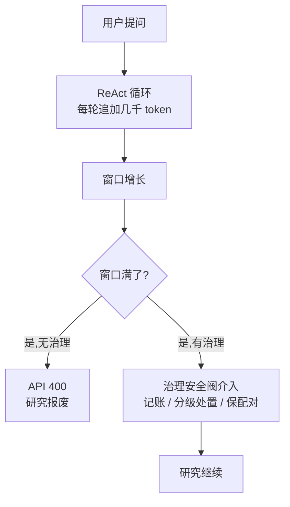

*这张图画了两个世界:没有治理时,窗口满了直接 400 报废;有治理时,安全阀在窗口满之前介入,研究继续。*

## 1.2 治理要回答的三个问题

安全阀要干三件事,缺一不可:

**第一,记账:我们到底占了多少窗口?** 不能靠猜。窗口占用比例(fraction)是所有处置的决策依据——只有精确知道占用到了 40% 还是 90%,才知道该用多重的处置。注意记账要记的是"真实模型窗口",不是配置里写的数字(第 4 章展开)。

**第二,分级处置:满了怎么办?** 由轻到重,像消防分级。先做无损的(把大块内容搬到磁盘上,不丢信息),再做有损的(压缩总结,丢掉细节保住骨架),最后才熔断收尾(强制结束工具调用,保住已有成果)。**能用无损方案绝不用有损方案**,是这条链的第一原则。

**第三,保证不 400:无论怎么处置,消息配对不能断。** 这是所有处置的共同底线。模型请求里有一条铁律:带工具调用的模型消息,必须跟着对应的工具结果消息(配对,pairing)。谁拆散了配对,谁就会触发 400。所以每一次处置——压缩、外化、熔断——动手之前都要先问:这一刀会不会砍断配对?(第 5、7、8 章全是围绕这个底线的防线。)

## 1.3 治理不是什么

把边界画清楚,才能理解设计取舍:

- **不是"清空重来"**。聊天机器人可以"忘记之前的对话",研究任务不能——跑到 60% 清空,前面查的证据全没了。所以治理是"保留进程、牺牲产物":保住研究问题、计划、发现(研究进程),牺牲原始工具结果(研究产物),最后熔断收尾而不是崩掉。
- **不是一刀切截断**。直接删掉最旧的消息当然简单,但会丢掉核心证据、还会砍断消息配对。治理宁可做"外化"(搬到磁盘)也不做"删掉"。
- **不是框架自带的**。LangGraph 不管窗口,管窗口是应用层自己的职责。这也是为什么治理做成中间件挂进主循环,而不是散落在图代码里。
- **不是事后补救**。它要在 400 之前预防,在窗口爬到阈值时逐级触发动作,而不是等 API 拒绝。

**本节源码出处**

本章无源码——机制从第 2 章开始。场景化引入可读 [ANALYSIS_REPORT.md](ANALYSIS_REPORT.md) §4.2 开头(367-373 行)作为延伸阅读。文档出处约定:此后每节出处列在本节末尾,格式为「文件名:行号 —— 看什么」。

---

# 第 2 章 骨架:治理长什么样

先地图后放大镜。这一章把三层结构、注册表、契约、状态背包立起来,后面各章只在时间线上调用它。本章会用到阶段 1 的中间件概念:钩子(hook)是中间件在循环各个时点被调用的入口,共 5 个——before_agent / after_agent(整次运行的开头结尾)、before_model / after_model(每次模型调用前后)、wrap_model_call / wrap_tool_call(包裹模型调用和工具调用,洋葱式层层包裹)。治理机制全部挂在这几个钩子上。

## 2.1 三层结构:公共渲染层 + 策略桥 + 策略大脑

治理层由三个中间件组成,按固定顺序挂在整个中间件链的**最前面**:

1. **TaggedContextMiddleware(渲染层)**:每个模型请求送出去之前,把状态渲染成模型看得懂的格式——上下文块、消息标签(第 3 章详讲)。
2. **MessageNormalizerMiddleware(规范化层)**:把多个 SystemMessage 合并成一条,因为 vLLM/Qwen/Anthropic 这类 strict 后端拒绝非开头的 SystemMessage(第 3 章一并讲)。
3. **StrategyMiddleware(策略桥)**:桥接器,持有"策略大脑"的实例,把 6 个钩子翻译成对策略的调用。

为什么拆成三层?**因为公共的归公共,可换的归可换**。前两个中间件是所有策略都需要的固定行为(渲染格式、消息规范化),永远不动;第三个是"插座",插什么策略由配置决定。想换治理策略,只需要换 StrategyMiddleware 手里那个"策略大脑",公共层完全不用碰——这就是"改造级"目标里"换记忆策略/治理策略"的落点(第 12 章给出完整操作)。

策略大脑是 **DefaultStrategy**,一个策略 bundle(可以理解为"一套完整的治理决策规则集")。它自己管理四个执行器:

- **BudgetTrackerExecutor(记账员)**:累计 token、算占用比例、按阈值挂"债单"。
- **ExternalizerExecutor(搬运工)**:把超大的工具结果搬出上下文、写到磁盘,留下预览。
- **SummarizerExecutor(压缩师)**:调用 LLM 把旧历史压缩成摘要。
- **SnapshotExecutor(摄影师)**:压缩前把全量状态拍照存档。

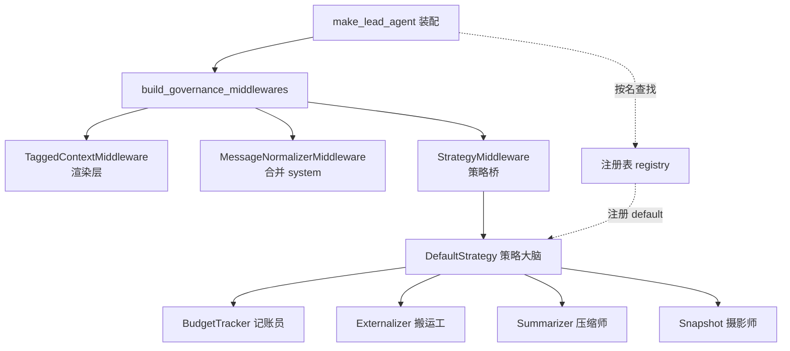

*这张图画的是治理层的装配结构:三个中间件从左到右,StrategyMiddleware 插着策略大脑,大脑指挥四个执行器;注册表在旁边负责"按名字找到策略类"。*

**「实现真相」一处**:factory 的装配注释里写着"治理层(公共 3 + StrategyMiddleware)",但实际公共中间件只有 2 个(TaggedContext + MessageNormalizer),加上 StrategyMiddleware 共 3 个中间件——注释笔误,以实际为准。

## 2.2 注册表:策略是怎么被找到的

"插什么策略"由配置里的 `context_governance.strategy` 字段决定,默认值是 `"default"`。但配置里写个字符串,怎么变成可执行的类?靠注册表。

机制很简单:策略类用 `@register_strategy("default")` 装饰器注册进一张全局表(名字 → 类),builder 在导入时主动 import 策略包目录触发注册,然后按配置的名字查表、实例化。找不到名字会抛 KeyError——但 builder 做了降级:策略未注册时不崩溃,只警告一声然后**只挂公共 2 个中间件,策略中间件整个跳过**。

> **实现真相:静默失效是最可怕的故障。** 配置默认值文件里记载着一个真实事故:有人把策略名误写成 `"minimal"`(一个不存在于注册表的过渡期名字),结果治理层静默降级为公共 2 个中间件——**没有报错**,但 budget/fraction 永远停在 0,压缩进度条不再更新。装配错误的表现不是崩溃,而是静默失效。这对改造者是重要教训:改完策略名,一定要确认策略中间件真的挂上了(日志里没有 "not registered" 警告)。

## 2.3 契约:六钩子与结果五通道

策略大脑和桥接器之间靠一份"契约"对话——这份契约让策略可以随意替换而不碰桥接器。契约分两个方向:

**入参(GovernanceContext):** 每个钩子被调用时,桥接器把当前状态打包成一个统一入参包:state(线程状态)、governance(治理自己的背包,见 2.4)、config(配置参数)、token_counter(计数函数)、runtime(运行时,可拿日志/线程信息)、hook(当前钩子名),以及各钩子特有的字段(messages、tools、model_request、tool_result)。策略大脑从包里取它需要的东西,不直接接触框架细节。

**出参(GovernanceResult):** 策略的处置结果通过五个"通道"返回,每个通道的语义不同:

| 通道 | 作用 | 持久性 |
|------|------|--------|
| state_patch | 写回线程状态(含 governance 背包) | 持久,进 checkpointer |
| request_override | 替换请求内容(渲染、外化后的消息) | 仅本次请求,不持久 |
| messages_patch | 消息级操作(删除/替换/新增消息) | 持久 |
| metrics | 指标产出(压缩次数、快照次数) | 持久 |
| jump_to | 跳转到图的指定节点(如跳回模型) | 仅本次循环 |

为什么分五个通道?**因为治理动作作用在不同的层**:改状态用 state_patch、改"送出去的样子"用 request_override、改消息列表本身用 messages_patch、汇报指标用 metrics、干预循环走向用 jump_to。把通道分开,是为了让"临时改一下"和"永久改状态"不互相污染——request_override 是 request-scoped(只对这一次请求生效,下一轮自动作废),state_patch 会经过 checkpointer 持久化(跨轮、跨 run 保留)。

契约还定义了 6 个钩子(before_agent、after_agent、before_model、after_model、wrap_model_call、wrap_tool_call),策略大脑按需实现。注意 wrap_model_call 和 wrap_tool_call 这两个包裹钩子只消费 request_override 通道——因为它们返回的是被包裹后的请求/结果,状态写入必须走 before/after 钩子。

跳转不是想跳就能跳:桥接器在 before_model 和 after_model 上声明了 `can_jump_to=["model"]`——这是向框架声明"我这个钩子允许把执行跳回模型节点"。没有声明,跳转会被框架拒绝。这是权限声明机制,不是随便写个字段。

> **实现真相**:契约提供了 6 个钩子,但 DefaultStrategy 的 wrap_model_call 是空操作——它没有在模型请求层面做任何干预。契约丰富不代表都用满了;学习时以"实际干了什么"为准,不要以"契约上有什么"为准。

## 2.4 状态背包:所有跨钩子状态为什么放进 ThreadState.governance

治理层有大量需要跨钩子、跨轮次传递的状态:预算账本、已见消息表、待处置债单、抑制门槛……这些状态放在哪?答案是线程状态(ThreadState)里的一个专门字段 `governance`,我们叫它**状态背包**。

背包的结构是命名空间式的:`governance.<strategy_name>.*`。DefaultStrategy 用 `governance.default.*` 作为自己的地盘,里面装:budget(预算账本)、seen_msgs(已见消息表)、pending(债单)、warned(熔断是否已提醒)、p1_completed / p1_skip_until_fraction(P1 的抑制状态)、summary(压缩摘要)、snapshot_path(快照路径)、metrics(指标)。

背包的写入走一个专门的合并器(reducer):`merge_governance`。它的语义是**深度合并、叶子键后写覆盖**——两个 dict 相同的键,如果都是 dict 就递归合并,否则新值覆盖旧值。为什么需要专门合并而不是整体替换?因为线程状态里可能同时有多个东西在写 governance(策略自己的不同钩子、其他策略的命名空间),整体替换会踩掉别人的数据;深度合并则让每个写者只改自己的叶子键。

为什么必须进 state,而不是用策略类的实例属性(普通 Python 对象属性)?三个理由:

1. **并发串味**:同一个 agent 可能被多个线程共享,实例属性会在不同线程之间串数据;
2. **可测试性**:状态显式进出,测试可以构造任意状态;
3. **跨轮持久**:线程状态的写入会经过 checkpointer(检查点持久化)存盘,下一轮、下一次 run 都能恢复——实例属性一轮循环结束就没了。

**骨架立完了。** 下面这张图是全书的地图——一次 run 的时间线总览。后面每一章都是它的放大镜。

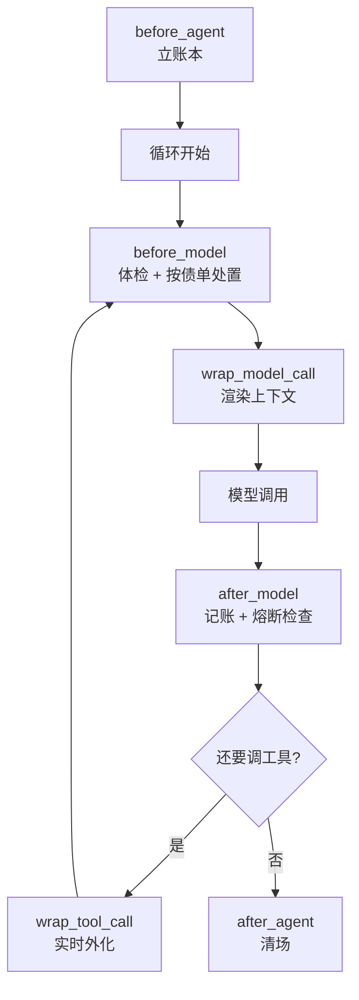

*这张图是全文的目录:一次 run 从立账本开始,进入"体检 → 渲染 → 模型 → 记账 → 工具"的循环,最后清场结束。记住它,后面每一章都在给它加细节。*

**本节源码出处**

- [factory.py:53-86](../poirot/backend/agents/leader/factory.py) —— 治理层挂载在中间件链最前(公共 2 + StrategyMiddleware),及整条链的装配顺序注释
- [builder.py:33-49](../poirot/backend/agents/context_engineering/builder.py) —— 三中间件组装、策略未注册时静默降级只挂公共 2
- [registry.py:18-42](../poirot/backend/agents/context_engineering/registry.py) —— 注册表:装饰器注册 + 按名查类(未注册抛 KeyError)
- [contract.py:13-46](../poirot/backend/agents/context_engineering/contract.py) —— GovernanceContext 统一入参、GovernanceResult 五通道(各通道语义与持久性注释)
- [contract.py:60-85](../poirot/backend/agents/context_engineering/contract.py) —— GovernanceStrategy 契约的 6 个钩子定义
- [strategy_middleware.py:84-104](../poirot/backend/agents/context_engineering/strategy_middleware.py) —— hook_config 声明 can_jump_to=["model"] 跳转许可
- [types.py:157](../poirot/backend/agents/state/types.py) —— ThreadState.governance 字段定义(注释:命名空间自管、全值可 JSON 序列化)
- [reducers.py:183-206](../poirot/backend/agents/state/reducers.py) —— merge_governance:deep-merge,叶子键 last-write-wins
- [defaults.py:41-49](../poirot/backend/agents/config/defaults.py) —— context_governance 配置默认值(strategy="default")
- [defaults.py:64-66](../poirot/backend/agents/config/defaults.py) —— "minimal" 误写事故:未注册 → 静默降级 → budget 恒 0(实现真相出处)
- [factory.py:76](../poirot/backend/agents/leader/factory.py) —— 注释"公共3"与实际公共 2+1 的笔误(实现真相出处)

---

# 第 3 章 模型看到的世界:渲染层

时间线上第一个"每轮都发生"的机制。它是治理的第一级减负——渲染层本身不删任何消息,但它决定了模型"看到"什么,也就决定了哪些内容值得留在上下文里。

## 3.1 为什么需要渲染层

状态里存的是什么?是一堆裸消息(HumanMessage、AIMessage、ToolMessage),外加一堆散落的字段(研究问题、计划、反思、摘要)。模型需要的却是一个**结构化、有层次的上下文**:先知道目标是什么、计划到哪了、之前总结过什么、今天是几号,再看对话历史。

渲染层做的事情就是"同一份状态,不同视图":它不修改 state(state 里存的是原始内容),只在**请求送出去之前**临时组装一份渲染后的视图,通过 request_override 通道替换请求内容。request-scoped,不持久——下一轮重新渲染。

**「实现真相」一处**:设计报告里的 `<observations>`(观察记录)标签在渲染层被舍弃了(渲染层只渲染 goal/plan/reflection/summary/date 五个标签)。observations 留在 state 里供反思中间件(ReflectionMiddleware)使用——这是"渲染层与治理层各管一段"的设计决策,渲染层不渲染它,不代表它没用。

## 3.2 上下文块与消息改写

渲染分两部分。

**第一部分:头部上下文块。** 把 state 字段渲染成一串扁平 XML 标签:研究目标(`<goal>`)、计划进度(`<plan>`)、反思(`<reflection>`)、治理压缩摘要(`
`)、当前日期(`<date>`)。系统提示词则提取出来包成 `<system>` 标签放在最前。注意 `
` 的来源是状态背包里的 `governance.default.summary`——这是治理压缩(第 7 章)给渲染层"递话"的通道:压缩后的摘要不是塞回消息历史,而是写进背包、由渲染层放进上下文块。**模型看到的摘要只有这一个来源。**

**第二部分:消息改写。** 对话历史里的每条消息被改写成带语义标签的形式:

- AI 消息的思考内容包成 `<thinking>`,正式回答包成 `<answer>`(机制层的 tool_calls 字段原样保留,不参与改写);
- 已被外化的工具结果(ToolMessage)渲染成只带 preview 的 `<toolresult name= path= tokens=>`,**完整内容不在请求里出现**——这正是外化(第 6 章)在渲染层的兑现;
- 压缩摘要那条特殊消息(HumanMessage 带 poirot.summary 标记)被跳过——因为它已经以 `
` 形式在上下文块里了,再发一遍是浪费;
- SystemMessage 被跳过——已经提取进 `<system>` 了。

为什么要转义(XML escape)?因为内容里可能包含 `<`、`>`、`&` 等字符,不转义会破坏标签结构,模型就会误解上下文边界。`<` 变成 `&lt;`,等等。

**标记命名空间 `poirot.*`。** 渲染层定义了七个标记常量,写在消息的 additional_kwargs 里:`poirot.thinking`(思考标记)、`poirot.summary`(摘要标记)、`poirot.externalized` / `poirot.externalized_path` / `poirot.externalized_meta`(外化三件套)、`poirot.compaction_stage`(压缩阶段)、`poirot.turn_id`(轮次号)。这些标记是第 4-8 章的"暗号仓库":压缩靠它们筛选、外化靠它们防重、审计靠它们追溯。先记住它们的存在,后面用到时回看这里。

**MessageNormalizer 在做什么?** 每个请求里可能有多个 SystemMessage(系统提示词、技能注入、上下文块……),而 strict 后端要求 SystemMessage 只能在开头且只能有一条。规范化层把 request 里的所有 SystemMessage 连同 request.system_message 合并成一条,其他消息原样保留。它只动请求载荷,不动 checkpointer 里的状态——这样历史扫描器等下游还能正常工作。

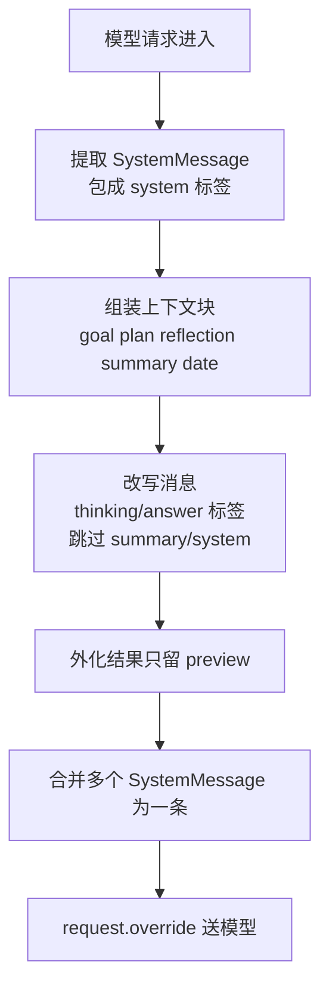

*这张图是渲染 pipeline:提取系统提示 → 组装上下文块 → 改写消息 → 规范化 → 覆盖请求。全程不动 state。*

## 3.3 渲染层与治理层的关系

一句话:**渲染层不删 state 里的消息,只改"送出去的样子";治理层(第 4-8 章)才动 state 本身。** 这两层职责分离是设计上刻意为之:

- 渲染层负责"模型的视角"——什么格式、什么顺序、什么该看到;
- 治理层负责"上下文的健康"——什么该删、什么该搬走、什么该压缩。

它们通过两个接口协作:治理层的处置结果(外化标记、压缩摘要)写进 state,渲染层读 state 决定怎么渲染。另外渲染层在 after_model 会做一次**审计快照**:用另一个渲染器(按 `<turn>` 时序分组的版本)把"模型看到的视图"渲染出来存进 state.tagged_context——这样你可以对比"模型看到的"和"state 里存的"是不是一致,排障时很有用。

**本节源码出处**

- [tagged_context_middleware.py:37-43](../poirot/backend/agents/middlewares/tagged_context_middleware.py) —— poirot.* 七枚标记常量定义(层 2 标记命名空间)
- [tagged_context_middleware.py:66-87](../poirot/backend/agents/middlewares/tagged_context_middleware.py) —— render_context_block:上下文块五标签组装(<observations> 舍弃注释)
- [tagged_context_middleware.py:100-104](../poirot/backend/agents/middlewares/tagged_context_middleware.py) —— 
 从 governance.default.summary 取(治理递话通道)
- [tagged_context_middleware.py:209-244](../poirot/backend/agents/middlewares/tagged_context_middleware.py) —— render_messages_for_llm 消息改写(跳过 summary/system、AI 包 thinking/answer)
- [tagged_context_middleware.py:204-207](../poirot/backend/agents/middlewares/tagged_context_middleware.py) —— XML 转义(_escape)
- [tagged_context_middleware.py:280-294](../poirot/backend/agents/middlewares/tagged_context_middleware.py) —— _assemble:组装上下文块 SystemMessage + 改写历史,request.override(request-scoped)
- [tagged_context_middleware.py:297-307](../poirot/backend/agents/middlewares/tagged_context_middleware.py) —— after_model 审计快照写 state.tagged_context
- [message_normalizer_middleware.py:46-64](../poirot/backend/agents/middlewares/message_normalizer_middleware.py) —— _coalesce:合并多 SystemMessage 为单条 leading(仅动 request,不动 checkpoint)

---

# 第 4 章 记账:精确知道我们占了多少

时间线:run 开始(before_agent)与每轮结束(after_model)。没有这一章,fraction 不存在,后面所有处置都无从谈起——这是整个治理金字塔的地基。

## 4.1 before_agent:立账本

run 开始的那一刻,策略大脑在 before_agent 钩子里做的第一件事是**立账本**(init_budget):把预算账本清零(输入/输出/总计 token 全 0,窗口 0,占用比例 0)、已见消息表清空、债单清空、熔断提醒标志关掉、P1 抑制门槛归零。

为什么"立账本"要放在 run 开始而不是策略构造的时候?因为状态进 state(第 2.4 节):每次 run 从 checkpointer 恢复,如果账本是构造时建立的类属性,上一轮 run 的数据会串进来;在 before_agent 里重建,保证每次 run 从干净状态出发。

## 4.2 after_model:每轮记账

每轮模型调用结束后(after_model),记账员做两件事,维护**两个口径**的数字:

**口径一:本轮烧了多少(累计口径)。** 账本里的 input/output/total 是跨轮累计的。怎么累计?用"已见消息表"做增量:每条 AI 消息都有唯一 id,消息里带 usage_metadata(这一轮调用实际消耗的 token 数)。同一消息 id 可能被更新多次(模型回答后追加工具调用等),记账员按 id 记录"上次见过的数字",每轮只把**正的差值**加进账本——即"这条消息从上次见到现在,多烧了多少"。注意只累计正 diff(只加不减),因为 token 只会越积越多。

**口径二:现在窗口里有多少(全量口径)。** 每轮用计数函数把**当前全部消息**重新数一遍,得到 current——这是"现在窗口里实际占了多少"的精确值。占用比例 fraction = current ÷ window(窗口大小,见 4.3)。

两个口径为什么都需要?total 回答"这次研究到目前为止烧了多少 token"(监控成本),fraction 回答"还剩多少空间"(驱动处置)。**fraction 只由全量口径算**——处置决策用的是"此刻的真实占用",不是累计值。

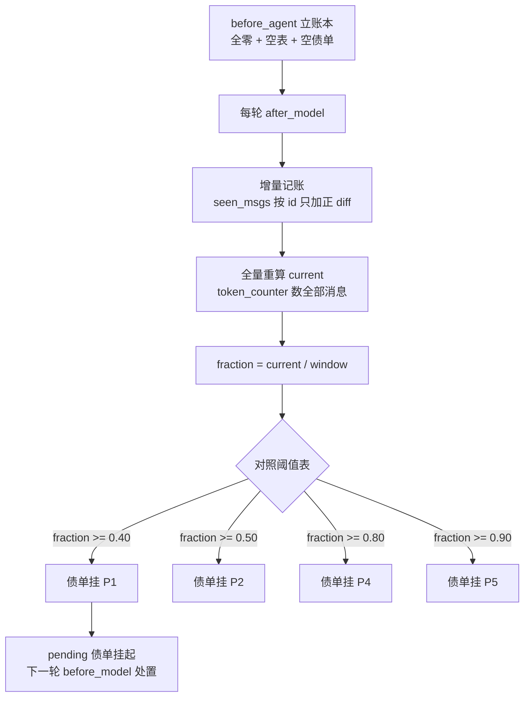

*这张图是记账流程:立账本 → 每轮先做增量记账再做全量重算 → 算 fraction → 对照阈值挂债单 → 债单留给下一轮处置。注意记账与处置分属两轮(见 4.5)。*

## 4.3 窗口大小从哪来:穿透"外壳"拿真实窗口

fraction 的分母是窗口大小。它从哪来?**不是配置文件里写死的 128k**,而是每轮动态解析真实模型窗口。

难点在于:agent 用的模型是一个"外壳"——FallbackChatModel,一个装着多个真实模型的降级链(第一个模型挂了自动切第二个)。外壳本身只暴露 provider 列表和当前活跃索引,**没有窗口信息**。所以解析必须穿透外壳,剥到内层真实模型。

解析是五级递进:

1. **穿透外壳**:读外壳的模型列表,取当前活跃的那个,剥掉 bind_tools 包装(拿到底层真实 ChatModel),递归解析;
2. **模型属性**:查 max_input_tokens / model_max_tokens / max_tokens 属性;
3. **标识参数**:查 _identifying_params 里的同类字段;
4. **名字前缀匹配**:用模型名在窗口映射表里做前缀匹配(映射表覆盖各家模型,如 deepseek-v4-flash→200k、qwen→32k、gemini→2M;长前缀优先,避免 "gpt-4" 误配 "gpt-4o");
5. **兜底**:全查不到用 128000。

为什么要穿透?"降级到 qwen 时治理自动改用 131k 窗口计算"——外壳表面只有 provider 列表,穿透后才是真实容量。**fraction 的分母必须是真实窗口,否则阈值判断就错了**——用 200k 的模型按 128k 算,会过早触发处置;反过来会过晚。另外配置参数里的 window 字段可以显式覆盖整条解析链(测试时常用)。

## 4.4 token 怎么数:tiktoken 优先,字符估算兜底

计数函数 token_counter 两个选择:

- **tiktoken 精确计数**:OpenAI 开源的 tokenizer,按模型名加载对应编码器。懒加载(第一次用才导入,启动不背这个成本),失败后有 600 秒冷却(失败后十分钟内不重试,避免每轮都去撞一次导入错误)。
- **字符估算兜底**:tiktoken 不可用时,用 CJK 感知的字符估算——中文字符(CJK)1 个字符 ≈ 1 token,非 CJK 4 个字符 ≈ 1 token。为什么对中文场景有意义?tiktoken 编码中文会切得很碎,估算时按字符权重更接近真实占用。

## 4.5 挂债单:从 fraction 到 pending

阈值表定义了六级分段:0.40(P1 外化)、0.50(P2 思考标记)、0.60(P3 观察截断)、0.80(P4 压缩)、0.90(P5 熔断)、0.99(硬停)。每轮记账后,把 fraction 与每个阈值比较,**达到哪个挂哪个债单(pending)**。

关键语义:**债单是累积的,不是互斥的**。fraction 0.85 时,pending 列表是 [P1, P2, P4]——P1 的债还没还(或还了一部分),P4 的债又挂上了。下一轮 before_model 按债单逐级处理(第 6-8 章)。

**延迟一轮**是全治理层最重要的时序设计:**账是这一轮 after_model 记的,处置在下一轮 before_model 做。**为什么不能记账后立刻处置?因为工具结果要等下一轮才全量落进 state——这一轮处置,可能处置的是"还没记录完的结果"。先记账、后还债,保证处置面对的是完整的消息状态。

> **实现真相两处**:
> 1. **P2 阈值无人消费**:债单会挂 P2,但全项目没有任何钩子检查 "P2" in pending。设计蓝图里 P2 是"标记思考消息供渲染层折叠",实际实现是**每轮无条件**给所有带 reasoning_content 的 AI 消息打思考标记(_mark_thinking),与阈值无关——渲染层折叠思考的机制存在,但不由 P2 驱动。
> 2. **P3 触发源断链**:债单判定里根本没有 P3(阈值表里有 0.60 这个数字,但记账员从不挂 P3 债单)。消费端倒是写好了——before_model 里有一个 P3 分支,计算 observations 的截断数量并记录 trace,但它永远等不到 "P3" in pending,所以永不执行。启用它只需要在记账员的阈值判定里加一行:达到 0.60 时挂 P3。这是一个完整的"预留机制"样板。

**本节源码出处**

- [budget.py:14-24](../poirot/backend/agents/context_engineering/strategies/default/budget.py) —— init_budget:立账本(全零 budget、空 seen_msgs、空 pending、warned 关、抑制门槛归零)
- [budget.py:26-66](../poirot/backend/agents/context_engineering/strategies/default/budget.py) —— track:增量记账(seen_msgs 按 id 只加正 diff)+ 全量重算 current + fraction + 阈值挂债单(注意:判定无 P3)
- [budget.py:51-60](../poirot/backend/agents/context_engineering/strategies/default/budget.py) —— P3 断链点:加一行即可启用 P3(实现真相出处)
- [utilities.py:150-161](../poirot/backend/agents/context_engineering/utilities.py) —— token_counter:tiktoken 优先 + 字符估算兜底
- [utilities.py:115-125](../poirot/backend/agents/context_engineering/utilities.py) —— _char_estimate:CJK 感知估算(中文 1 字符≈1 token,非 CJK 4 字符≈1 token)
- [utilities.py:164-209](../poirot/backend/agents/context_engineering/utilities.py) —— resolve_window_size:五级解析(外壳穿透 → 模型属性 → 标识参数 → 前缀匹配 → 128000 兜底)
- [utilities.py:19-80](../poirot/backend/agents/context_engineering/utilities.py) —— 窗口映射表(长前缀优先)
- [strategy.py:34-41](../poirot/backend/agents/context_engineering/strategies/default/strategy.py) —— 阈值表(_DEFAULT_THRESHOLDS,六级)
- [strategy.py:248-251](../poirot/backend/agents/context_engineering/strategies/default/strategy.py) —— after_model 里 config 显式 window 优先于动态解析

---

# 第 5 章 例行体检:配对保护

时间线:每轮送模型之前(before_model 第一步)。无论欠多少债,体检先做——因为配对断裂是最常见的 400 源头,而它是可以预防的。

## 5.1 为什么体检:API 400 的头号杀手

先讲清楚什么是"配对"(pairing)。模型请求里有三种基本消息:用户消息(HumanMessage)、模型消息(AIMessage)、工具结果消息(ToolMessage)。当模型决定调用工具时,它的 AIMessage 里会带 tool_calls 字段(要调什么工具、参数是什么、有一个工具调用 id)。框架接下来会执行工具,并把结果作为 ToolMessage 返回,**这个 ToolMessage 必须通过 tool_call_id 与对应的 AIMessage 配对**。

配对断裂有几种形态:有 tool_calls 的 AIMessage 后面没有配对 ToolMessage;或者反过来,孤儿 ToolMessage 前面没有对应的调用。机制层(严格 API)一旦发现这种断裂,直接 400——研究任务报废。

断裂是怎么发生的?正常流程不会断,但治理处置(压缩、外化)动过消息之后就可能断:切堆切散了配对、删除了调用但留下了结果……所以每轮送模型之前必须体检一遍。

## 5.2 体检怎么做:_ensure_pairing

体检逻辑是一个扫描:收集所有 ToolMessage 的 tool_call_id,形成一个"已配对"集合;然后扫描所有带 tool_calls 的 AIMessage,逐个检查它的调用 id 是否在集合里。缺配对的,补一条 **error 占位 ToolMessage**(内容"工具结果缺失,已补占位",状态 error)。

为什么补占位而不是删掉调用?删掉调用要改 AIMessage 本身(更重的操作),补占位是**最小修复**:配对补全了,模型看到的是一条错误提示,研究继续。这个修复本身也有价值:模型能看到"这个工具调用没有结果",可以决定重试或换路。

体检不早退:体检结果(pairing_patch)与压缩/外化结果**合并返回**——体检发现断裂不会阻塞压缩处置进行,两个结果拼在一起一次性返回。这保证了"体检"和"还债"互不拖累。

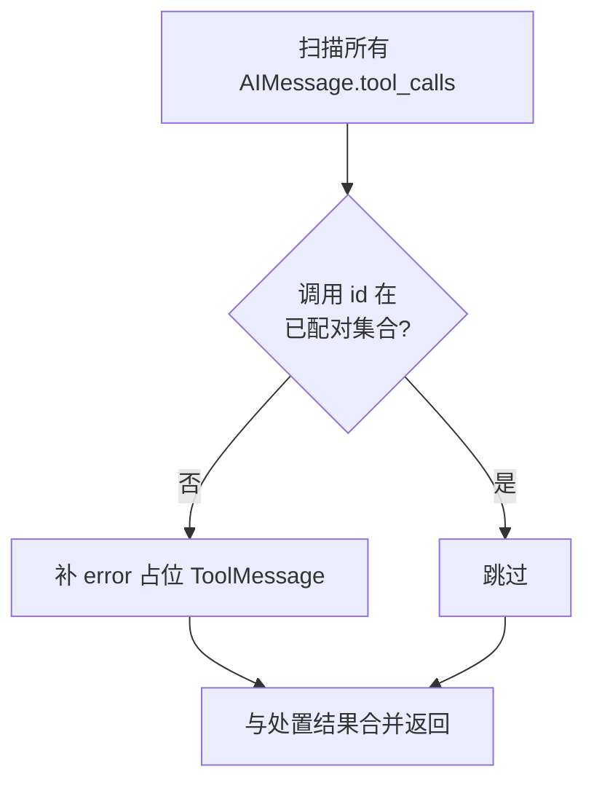

*这张图是配对体检:扫描所有工具调用,缺配对的补 error 占位,结果与处置合并返回。*

## 5.3 配对防线全景(预告)

体检只是最后一道兜底。真正的配对防线分布在处置机制里(第 6-8 章逐一兑现):

- 第 6 章 P1 外化:外化只改内容不改结构,天然不破坏配对;
- 第 7 章 P4 压缩:三道手术防线(切点吸附、孤儿清扫、孤儿外化)专防压缩切散配对;
- 第 8 章 P5 熔断:剥 tool_calls 时复用原消息 id 替换而非追加,不产生孤立调用。

**四道防线层层递进,体检是它们共同的最后兜底**——前面哪一道失手了,下一轮体检把断裂补上。这就是"保证不 400"不是一条规则,而是一套系统的样子。

**本节源码出处**

- [strategy.py:172-187](../poirot/backend/agents/context_engineering/strategies/default/strategy.py) —— _ensure_pairing:收集已配对 id → 扫描调用 → 缺配对的补 error 占位
- [strategy.py:89-92](../poirot/backend/agents/context_engineering/strategies/default/strategy.py) —— before_model 第一步调用体检,注释"不早退"
- [strategy.py:118-126](../poirot/backend/agents/context_engineering/strategies/default/strategy.py) —— 体检结果与压缩结果合并返回

---

# 第 6 章 P1 外化:最轻的处置,无损的减负

时间线:两条路径——wrap_tool_call 实时源头截流(每轮都生效,与阈值无关)+ before_model 批量清旧账(P1,阈值触发)。这是分级链里最轻的一级,也是**首选**——因为它是无损的。

## 6.1 为什么外化是"首选"

外化的动作是:**把超大的工具结果从上下文里搬出去,原样写到磁盘文件,在消息里只留预览(preview)+ 文件路径**。信息一点没丢——模型需要细节时,可以调用 read_snapshot 之类的工具读回文件。有损处置(压缩)是它干不动之后的兜底。

为什么"无损"这么重要?因为研究进程的上下文是不可再生的:原始搜索结果、网页全文,删了就是删了。外化让它换个地方活着,随时能取。

外化有两条触发路径,分工不同:**实时路径**管"新产生的大块内容,源头截流";**批量路径**管"历史积累的旧账,阈值触发"。先立这个结构,下面分讲。

## 6.2 实时外化:wrap_tool_call,源头截流

工具调用结束后,结果返回的那一刻,wrap_tool_call 钩子(包裹工具调用的后置时机)有机会**在结果进入 state 之前**检查它:内容长度超过阈值(默认 500 字符起步,按工具元数据调整,见下)就立刻写盘、替换成预览。为什么在 wrap_tool_call 而不是 after_model?因为这是**消息产生的源头**——在源头截流,大块内容根本不进 state,窗口和存储同时瘦身;到了 after_model 再处理,它已经占了内存和窗口了。

写盘有几个工程细节:

- 内容能解析成 JSON 就存 `.json`(缩进格式化,人类可读),否则原样存 `.txt`;
- 文件名是"工具名 + 调用 id 短截",可追溯;
- 预览 = 前 500 字符 + 一行 `[externalized path=... tokens~N]` 标记(路径和估算节省的 token 数);
- 幂等:已外化的消息带 poirot.externalized 标记,再见到直接跳过,不会重复写盘;
- 阈值可以按工具调:有工具元数据(typical_output_tokens,装配时从工具注册信息注入)的工具,阈值取 `max(500, 典型输出 token × 4)`——一个典型输出就 3000 token 的工具,500 字符阈值太容易误伤,放大到 12000 字符才值得外化。

一个直觉场景:某工具返回 20k 字符的原始数据,模型其实只需要结论。实时外化把它变成 500 字符预览 + 路径,模型从预览判断"要不要读全",要读就调工具读文件。**窗口省了,信息没丢。**

## 6.3 批量外化:before_model,P1 触发

fraction 达到 0.40 挂上 P1 债单后,下一轮 before_model 执行批量外化:按 FIFO(最早优先)扫描历史,把旧轮次里的大工具结果逐个外化。

批量扫描有几道保护,保证"旧账可以清,新账不乱动":

- **按轮次分堆**:消息按 HumanMessage 切成轮次(turn),一轮 = 用户提问到下一次提问之间的一段;
- **近 2 轮豁免**:最近 2 轮是进行中的上下文,不碰——模型正在用它们推理;
- **每轮保最新 1 条**:每一轮里最新的那条工具结果保留——那通常是结论性的;
- **长度门槛**:短于 min_chars(500 字符)的也不动——外化也要成本(写盘 + 模型可能读回),小内容不值得;
- **幂等**:已外化的跳过。

全部候选外化完成后,返回替换后的消息列表(同 id 替换,add_messages 语义,不是追加)。替换后的消息带外化标记,下一轮渲染层渲染成 `<toolresult path=...>`(第 3 章已见)。

## 6.4 间隔抑制:迟滞环,防振荡

P1 有个独特的问题:**振荡**。外化一批 → fraction 降下来 → 模型继续跑 → fraction 又涨过 0.40 → 又外化一批……如果每次涨过阈值都立刻执行,外化会变成每轮都做的高频动作,同步写盘代价不小。

解决办法是**间隔抑制(迟滞环,hysteresis)**:每次 P1 执行后,把抑制门槛设为"当前 fraction + 10%"——fraction 没涨破这个新门槛之前,P1 直接跳过(记一条 skipped trace)。门槛 = 当前值 + 步长,意味着要涨够 10% 才再清一次账。这是控制论里的经典做法:用"进入阈值"和"退出阈值"的错开,换取稳定,防止系统在临界点反复震荡。

> **实现真相一处**:P1 是完整实现的三级处置之一(P1/P4/P5);阈值表里与它并列的 P3 则触发端断链(第 4.5 节)。同为阈值驱动,一个完好一个断链——读代码时以实际接线为准,不要被阈值表迷惑。

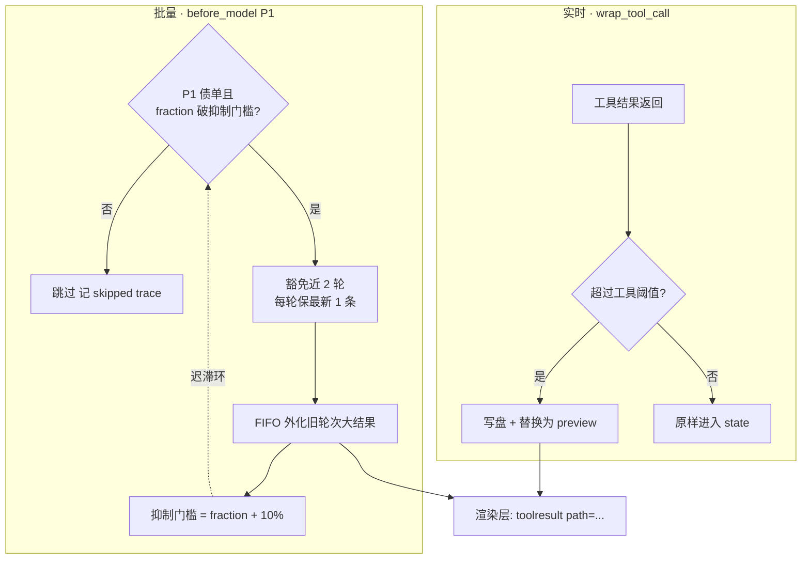

*这张图是外化的双通道:左边实时通道(工具结果一返回就判,超阈值写盘换预览),右边批量通道(P1 债单 + 抑制门槛通过才执行,豁免近 2 轮 + 每轮保 1,外化完抬升门槛)。右下角的环是迟滞环:门槛随执行抬升,防止每轮都外化的振荡。*

**本节源码出处**

- [externalizer.py:42-48](../poirot/backend/agents/context_engineering/strategies/default/externalizer.py) —— _get_threshold:按工具元数据调阈值(max(min_chars, typical_tokens×4))
- [externalizer.py:50-67](../poirot/backend/agents/context_engineering/strategies/default/externalizer.py) —— externalize_if_needed:单条外化(幂等检查、写盘、preview+path、poirot.externalized 标记)
- [externalizer.py:69-125](../poirot/backend/agents/context_engineering/strategies/default/externalizer.py) —— externalize_history:批量 FIFO 外化(近 2 轮豁免、每轮保 1、长度门槛、幂等)
- [externalizer.py:127-141](../poirot/backend/agents/context_engineering/strategies/default/externalizer.py) —— _partition_turns:按 HumanMessage 分轮次
- [externalizer.py:143-145](../poirot/backend/agents/context_engineering/strategies/default/externalizer.py) —— _is_externalizable 是死代码,未被调用(实现真相出处)
- [externalizer.py:165-187](../poirot/backend/agents/context_engineering/strategies/default/externalizer.py) —— _write_to_disk:JSON 可解析存 .json 否则 .txt,文件名工具名+id 短截
- [strategy.py:128-160](../poirot/backend/agents/context_engineering/strategies/default/strategy.py) —— P1 分支与间隔抑制(门槛 = fraction + 0.10,skipped trace)
- [strategy.py:342-351](../poirot/backend/agents/context_engineering/strategies/default/strategy.py) —— wrap_tool_call 实时外化(POST 时机,结果进 state 之前)
- [bootstrap.py:503-511](../poirot/backend/app/bootstrap.py) —— tool_metadata 从工具注册信息注入治理参数(装配时)

---

# 第 7 章 P4 压缩:有损处置,但先把证据保全

时间线:before_model 处置的第二优先级。这是全文机制最密集的一章,也是治理层唯一"有损"的处置——所以它每一步都在回答同一个问题:**丢之前,先保全什么?**

## 7.1 为什么压缩是"最后的有损手段"

外化只搬大块内容,搬完之后窗口还是可能不够——消息历史本身太长了。这时只剩一条路:把旧历史压缩成一段摘要,丢掉细节,保住骨架。

先回答一个顺序问题:**检查顺序上 P4 在 P1 之前**(before_model 先看 P4 债单再看 P1),但讲解顺序上我们先讲 P1 再讲 P4。这是有意的——**处置由重到轻检查,做最高级的就够**。P4 压完,窗口大降,再执行 P1 意义不大,所以同轮只做最高级处置(P4 触发就直接返回,P1 不执行)。教学上则按认知由轻到重:P1 无损易懂,理解它之后,P4 的"有损但保全"才立得住。

压缩的代价:有损。所以压缩前必须保全——**快照 + 孤儿外化**,这是本章的灵魂:"丢之前先保全数据"。

## 7.2 第一步:快照

压缩动手之前,摄影师先把**全量消息 + 状态关键字段**(研究问题、计划 todos、观察 observations、反思 reflection_items)序列化写进 `.poirot/snapshots/snapshot-{时间戳}.json`。为什么把 state 字段也拍进去?因为压缩要丢掉的消息里,那些字段相关的上下文细节会一起消失,快照里留一份完整副本。

快照路径记进状态背包(governance.default.snapshot_path),并在指标里累计快照次数。

读回闭环:快照不是拍了就完。有一个内置工具 read_snapshot,入参是快照路径,**模型可以调用它读回压缩前的完整内容**——"压缩后还能问快照"。模型怎么知道路径?从 `
` 标签或上下文提示里拿(压缩摘要会带上路径引用)。这样压缩之后,模型发现自己需要某个被压掉的细节,可以直接读回,而不是瞎猜。

> **实现真相一处**:快照的"读回"不是 SnapshotExecutor 的方法,而是另一个模块里的内置工具(带 @tool 装饰)——写入归治理层,读取归工具面,两边通过路径字符串衔接。

## 7.3 第二步:切堆

快照拍完,压缩师把消息分成两堆:要压缩的旧堆(to_summarize)和保留的新堆(preserved)。分堆规则很简单:**保留最近 6 条(preserve_recent),其余全进旧堆**。为什么保留 6 条?正在进行的上下文(最近几轮对话 + 工具结果)必须原样在场,模型推理要用;只有尘埃落定的旧历史才值得压缩。

## 7.4 第三步:三道手术防线

分堆不能闭眼切——切点可能正好落在配对的中间。这里有三道手术防线,每一道都在防一种 400:

**第一道:切点吸附(_snap_to_pairing)。** 如果切点正好落在一条 ToolMessage 上(它被切进旧堆,而它的配对 AIMessage 在保留堆),配对就断了。修复:检查切点前一条消息,如果它是带 tool_calls 的 AIMessage,**把切点回退一条**,让这对配对一起进旧堆或一起保留。

**第二道:孤儿清扫(_strip_orphan_tools)。** 切完之后,保留堆里可能有孤儿:孤立 ToolMessage(配对 AIMessage 被切进旧堆了)或孤立 AIMessage(带 tool_calls 但结果被切走了)。这些孤儿留着会在下一轮请求里触发 400。修复:把保留堆里的孤儿**移回旧堆**——它们随旧堆一起被压缩掉。

**第三道:孤儿外化(_externalize_orphans)。** 旧堆里被切散的孤立 ToolMessage(它们配对的 AIMessage 在保留堆,或者本来就缺),压缩会直接丢掉它们的完整内容。修复:**压缩丢弃前,先外化写盘**,路径追加进压缩摘要文本——这样摘要里带着"这条工具结果在外化文件里,需要时读回"的线索。

讲每一道防线都回到同一个问题:它防的是哪种 400。切点吸附防"配对跨切点",孤儿清扫防"保留堆里出现孤儿",孤儿外化防"孤儿的完整内容白白丢进压缩"。三道都是同一底线(配对不 400 + 无损优先)的落地。

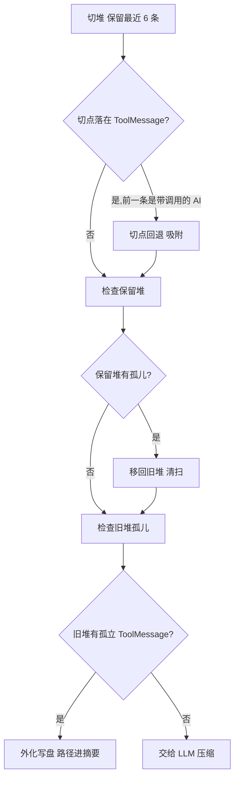

*这张图是压缩的三道手术防线:切点落在 ToolMessage 时回退吸附;保留堆里的孤儿移回旧堆;旧堆里的孤儿先外化再压缩。每道防线都防一种配对断裂。*

## 7.5 第四步:LLM 总结与替换

防线清完,旧堆交给 LLM 压缩成摘要。几个机制点:

- **独立模型**:可以用专门的 summarize_model(配置里指定,独立于主模型),没有则用主模型。为什么独立?压缩是一次"安静的内部调用",不该占用主模型的推理节奏,也可以用更便宜/更快的模型;
- **专用提示词**:加载专门的压缩提示词模板,里面有详细的保留规则——**必须保留 P0 核心**(研究目标原样保留、计划进度、反思条目、关键发现 top 3-5、工具调用的结论 + id + 外化路径、关键决策的"双态"记录:选了什么 + 否了什么 + 原因),**可以丢弃低价值内容**(思考中间步骤、重复信息、已外化的原始输出、失败的尝试、客套话);
- **内部调用标记**:压缩的模型调用带 internal_llm 标签,流式输出服务会过滤这个标签——压缩过程**悄悄进行,不泄漏到用户界面**;
- **失败降级**:LLM 调用任何一步失败,摘要降级为一行字"压缩失败,保留最近对话"——宁可失败也不崩溃,保留的 6 条消息还能继续工作。

替换的机制很关键:压缩结果不是简单删旧消息,而是用一个**消息级操作**表达"清空全部 + 放入新摘要 + 保留最近 N 条"。这个操作叫 RemoveMessage(REMOVE_ALL)——它**标记删除而不是就地删除**,由 LangGraph 的消息 reducer 统一处理。为什么标记删除?因为要保证 checkpointer 的增量保存语义,并且让所有中间件都能看到"这条消息被标记删除了"。

替换完成后,摘要走**双通道**:

- 通道一:摘要作为一条带 poirot.summary 标记的 HumanMessage 放进消息历史(留在 checkpointer 里作档案);
- 通道二:摘要写进状态背包 `governance.default.summary`(连同 summary_id、压缩次数指标)。

模型实际看到的是哪个?**只有通道二**——渲染层把 summary 渲染进 `
` 标签(第 3.2 节),而消息历史里的摘要消息在渲染时被跳过(避免重复)。这就是治理与渲染层的协作:治理产出,渲染消费。

> **实现真相一处**:设计蓝图里,压缩丢弃消息前应该先通过 MemorySink 接口把丢弃的内容"冲刷"进长期记忆(压缩 + 记忆沉淀的闭环)。但 MemorySink 契约在代码里**只有定义,没有任何实现方**(第 11 章详细说)。目前压缩前的保全手段就是快照 + 孤儿外化,记忆沉淀这条链路是断的——这是改造者的机会点。

**本节源码出处**

- [snapshot.py:21-40](../poirot/backend/agents/context_engineering/strategies/default/snapshot.py) —— snapshot_if_pending:压缩前快照(全量消息 + state 关键字段),路径记入 governance.default.snapshot_path
- [snapshot.py:42-51](../poirot/backend/agents/context_engineering/strategies/default/snapshot.py) —— _build_snapshot:快照内容(消息 + research_question/todos/observations/reflection_items)
- [read_snapshot.py:8-19](../poirot/backend/agents/agent_tools/builtin/read_snapshot.py) —— read_snapshot 内置工具:LLM 读回快照(实现真相:读取归工具面,不在治理层)
- [summarizer.py:49-60](../poirot/backend/agents/context_engineering/strategies/default/summarizer.py) —— _partition:切堆(保留最近 6 条)
- [summarizer.py:90-96](../poirot/backend/agents/context_engineering/strategies/default/summarizer.py) —— _snap_to_pairing:切点吸附(切点落在 ToolMessage 且前一条是带调用的 AI 则回退)
- [summarizer.py:62-88](../poirot/backend/agents/context_engineering/strategies/default/summarizer.py) —— _strip_orphan_tools:孤儿清扫(保留堆的孤立 ToolMessage/AI 移回旧堆)
- [summarizer.py:98-114](../poirot/backend/agents/context_engineering/strategies/default/summarizer.py) —— _externalize_orphans:孤儿外化(旧堆孤立 ToolMessage 压缩前写盘,路径进摘要)
- [summarizer.py:116-128](../poirot/backend/agents/context_engineering/strategies/default/summarizer.py) —— _call_llm:压缩调用(独立模型、internal_llm 标签、失败降级)
- [summarizer.py:27-47](../poirot/backend/agents/context_engineering/strategies/default/summarizer.py) —— summarize_if_pending:主流程(RemoveMessage(REMOVE_ALL) + summary 消息 + 保留消息)
- [summarizer.py:138-147](../poirot/backend/agents/context_engineering/strategies/default/summarizer.py) —— _update_summary:摘要双通道之二(governance.default.summary + summary_id + summarize_count)
- [summarize.md:14-45](../poirot/backend/agents/prompts/system/context_engineering/default/summarize.md) —— 压缩提示词:保留规则 P0 核心 / 可丢弃 / 决策双态(closure marker)
- [stream_service.py:178-183](../poirot/backend/app/services/stream_service.py) —— internal_llm 标签过滤:压缩调用不泄漏到 CLI
- [contract.py:88-93](../poirot/backend/agents/context_engineering/contract.py) —— MemorySink 契约:压缩丢弃消息前可调 flush,全项目无实现方(实现真相出处)

---

# 第 8 章 P5 熔断:最后一道保险

时间线:after_model 记账刚完成时。这是分级链的最后一环——前几级都是"减负",这一级是"保命"。

## 8.1 为什么熔断发生在 after_model

回想第 4.5 节的时序设计:记账在 after_model,处置在下一轮 before_model。但熔断是唯一的例外——**它必须在记账之后立刻执行,没有延迟一轮的余地**。为什么?

- before_model 处置的是"上一轮欠的债",而熔断要处置的是"**这一轮刚犯的险**":模型刚生成了一条带工具调用的 AI 消息,而窗口已经 90% 满了——如果等下一轮,这条消息要先执行工具、工具结果再进窗口,窗口可能当场爆掉;
- after_model 时机上,账刚记完(fraction 就在手上),而 messages 里最后一条 AI 消息(刚生成的)也现成——**判据和操作对象都在手上**,没有理由等。

## 8.2 熔断四连:剥调用、注提醒、跳模型、防死循环

熔断是四个动作的组合:

**第一,剥调用(_strip_tool_calls)。** 找到最后一条带 tool_calls 的 AI 消息,把它替换成一个**同 id、tool_calls 为空**的版本。同 id 是关键——LangGraph 的消息合并语义(id 相同即替换,不是追加),所以这是一次"替换"而不是"新增一条消息"。同时同步剥掉 additional_kwargs 里的 tool_calls/function_call 字段——这个细节防的是另一个中间件(todo/loop 检测)读到"这轮还要调工具"的误判。剥完之后,这条消息从"我要调工具"变成"我说了一句话",配对断裂无从发生。

**第二,注提醒。** 注入一条特殊的用户消息(name=context_budget_stop,界面隐藏),文案按 fraction 分两档:90% 档是"软收尾"——请基于已有信息收尾,不再调用工具,证据不足就说明缺口;99% 档是"硬底线"——上下文占用已达 99%,强制收尾,不可再调用任何工具,立即给出最终答案。

> **实现真相:99% 硬停不是独立的熔断级。** 设计蓝图里六级分段表最后一档是"99% 硬停:立即给最终答案",看起来像一个独立的处置动作。但源码里**没有硬停钩子**——99% 只是熔断文案的一个分支:P5 的收尾消息在 fraction ≥ 99% 时用更严厉的措辞。设计报告把文案分支画成了分级,这是"报告蓝图 vs 源码实现"的一个典型差异。

**第三,跳模型(jump_to="model")。** 熔断结果带着"跳回模型节点"的指令:跳过了 ToolNode(工具执行节点)——被剥掉的 tool_calls 不再有机会执行,也不会产生新的工具结果进窗口。跳转许可(第 2.3 节 hook_config 声明的 can_jump_to=["model"])在这里闭环:框架允许跳,策略才跳。

**第四,防死循环(warned 标志)。** 熔断后模型被逼收尾,但模型如果还是不死心又生成 tool_calls,下一轮 pending 里还是 P5——再熔断一次、再跳一次……死循环。所以熔断设置 warned=True,下一次 after_model 检查到 warned 就不再重复熔断。warned 是 run 级状态,before_agent 立账本时重置(第 4.1 节)。

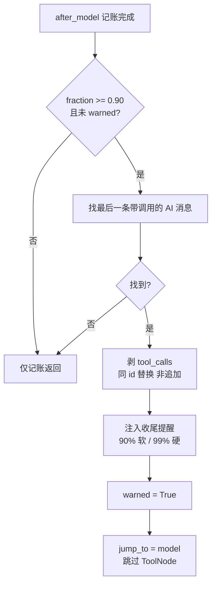

*这张图是 P5 熔断:记账完成、fraction 过线且未提醒过 → 找最后一条带调用的 AI 消息 → 同 id 剥调用 → 注入两档文案的收尾提醒 → 标记 warned → 跳回模型跳过工具执行。*

## 8.3 熔断之外的思考

熔断是"最后保险",不是"设计目标"。正常 run 不该走到 0.90——前几章的处置(P1 外化、P4 压缩)使命就是**让熔断不常发生**。从机制目标回看整个分级设计:40% 起靠外化保持无损,80% 起靠压缩保持轻装,90% 是最后防线。每一级都是为了推迟下一级的出现。

**四道防线总览**(收口第 5.3 节的预告):

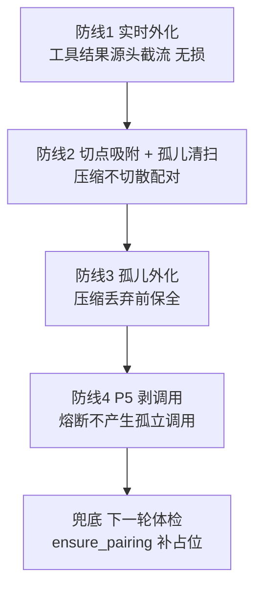

*这张图把第 6-8 章的防线串成一条线:实时外化 → 压缩手术(吸附+清扫)→ 孤儿外化 → 熔断剥调用 → 最后兜底是下一轮的配对体检。层层递进,越靠前越无损。*

**本节源码出处**

- [strategy.py:245-283](../poirot/backend/agents/context_engineering/strategies/default/strategy.py) —— after_model 主流程:记账 + P5 熔断(判 warned、找 last_ai、剥调用、注入提醒、jump model)
- [strategy.py:285-303](../poirot/backend/agents/context_engineering/strategies/default/strategy.py) —— _strip_tool_calls:同 id 替换 + 同步剥 additional_kwargs(防其他中间件误判)
- [strategy.py:305-319](../poirot/backend/agents/context_engineering/strategies/default/strategy.py) —— _build_stop_message:90% 软收尾 / ≥99% 硬底线文案分支(实现真相:硬停不是独立熔断级)
- [strategy.py:321-331](../poirot/backend/agents/context_engineering/strategies/default/strategy.py) —— _mark_thinking:思考标记每轮无条件打(P2 无人消费,实现真相出处)
- [strategy.py:252](../poirot/backend/agents/context_engineering/strategies/default/strategy.py) —— _mark_thinking 无条件调用点

---

# 第 9 章 收尾与调试:after_agent 清场 + 三通道 trace

时间线:run 结束。处置的最后一站是清理,以及把"发生了什么"留痕给人类。

## 9.1 after_agent 清场:过程态删除,产出态保留

run 结束(after_agent),策略大脑做清场(clear_run_state)。清场不是清空一切,而是**有选择的**:删掉"过程态",保留"产出态"。

- **删除(过程态)**:budget(账本)、seen_msgs(已见消息表)、pending(债单)、warned(熔断标志)、p1_completed / p1_skip_until_fraction(P1 抑制状态)——这些是 run 级的过程数据,下一次 run 开始时由立账本重建,留着只会串味;
- **保留(产出态)**:summary(压缩摘要)、summary_id、snapshot_path(快照路径)、metrics(指标)——这些是跨 run 复用的产出。下一次 run 的 `
` 渲染(第 3.2 节)读的是保留的摘要;模型想找回上次压缩的细节,快照路径还在;指标(压缩次数、快照次数)跨 run 累积。

这就是"研究任务跨 run 连续性"的机制基础:上次 run 压掉了什么、拍到哪,下次 run 全都接得上。

## 9.2 三通道 trace:压缩不是黑箱

处置过程不是默默发生就完——每一次处置事件(triggered 触发 / completed 完成 / skipped 跳过)同时写三个通道,让"发生了什么"可查:

1. **compaction.jsonl**:压缩全流程 trace。每次事件往 run 日志目录追加一行 JSON(时间戳、事件类型、阶段、fraction、window 等字段),路径 `.poirot/logs/threads/{线程id}/runs/{runid}/compaction.jsonl`;
2. **journal 事件日志**:关键事件(触发/完成/跳过)同步进运行事件日志(events.jsonl),键形如 compaction.triggered;
3. **stream 事件**:触发 → compaction_start、完成 → compaction_end,通过流式通道发给前端,CLI/TUI 渲染"正在压缩"的过程提示。

**第一调试站方法论**:一次 run 跑完,打开 compaction.jsonl 就能回答"这轮压缩发生了吗、为什么"——每一行都有 fraction 和阶段。它比任何日志都直接,因为它是治理层专门为"排障压缩"写的。

## 9.3 TUI 占用条:治理状态被 UI 消费

界面上的上下文占用条从哪来?流式服务从状态快照里提取 `governance.default.budget`,算出占用比例渲染进度条。这里有一个防闪烁细节:立账本(before_agent)会把 budget 重置成"全零快照"(window 0、fraction 0),如果把这个零状态也渲染出去,TUI 的占用条会"先掉到 0% 再恢复"——视觉闪烁。过滤条件很巧妙:**window == 0 是立账本独有的签名**(记账跑过之后 window 恒 > 0),看到它直接跳过不渲染。这个细节证明治理状态是"活"的——连 UI 都在消费它。

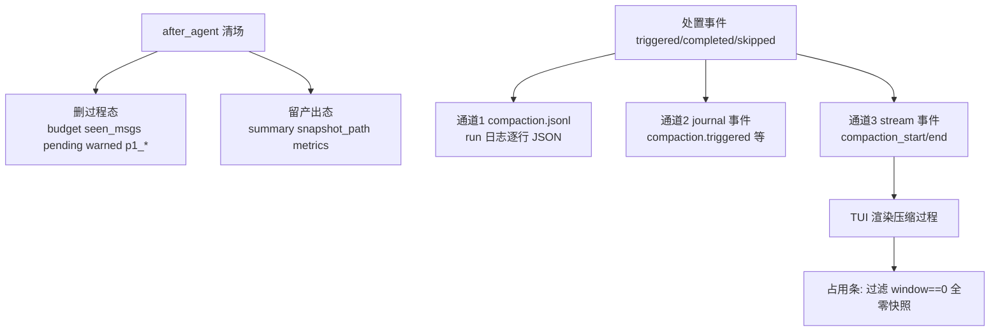

*这张图是收尾与 trace:清场时删过程态留产出态;处置事件同时写三个通道(文件日志、事件日志、流式事件);流式事件驱动 TUI,占用条靠 window==0 签名过滤全零快照防闪烁。*

**本节源码出处**

- [budget.py:68-74](../poirot/backend/agents/context_engineering/strategies/default/budget.py) —— clear_run_state:删 6 项过程态,保留 summary/summary_id/snapshot_path/metrics
- [strategy.py:189-227](../poirot/backend/agents/context_engineering/strategies/default/strategy.py) —— _emit_trace:三通道 trace(compaction.jsonl + journal + stream 事件)
- [strategy.py:229-240](../poirot/backend/agents/context_engineering/strategies/default/strategy.py) —— _get_run_dir:run 日志目录路径(threads/{tid}/runs/{rid})
- [strategy.py:199-227](../poirot/backend/agents/context_engineering/strategies/default/strategy.py) —— 事件类型映射(triggered→compaction_start / completed→compaction_end)
- [stream_service.py:283-296](../poirot/backend/app/services/stream_service.py) —— budget_update:从 governance.default.budget 提取占用率
- [stream_service.py:292-297](../poirot/backend/app/services/stream_service.py) —— window==0 过滤:init_budget 独有签名,防占用条闪烁

---

# 第 10 章 串起来:一次 run 的完整旅程

前 9 章是放大镜,这一章把镜头拉回来,把同一张时间线图(第 2 章图 3)重画一遍——但每个节点都带上机制名。每站一句话,回答"当时为什么介入"。这是"先详细后总结"的兑现:你应该能从这张图出发,向别人完整讲出治理机制。

## 10.1 一站一站走一遍

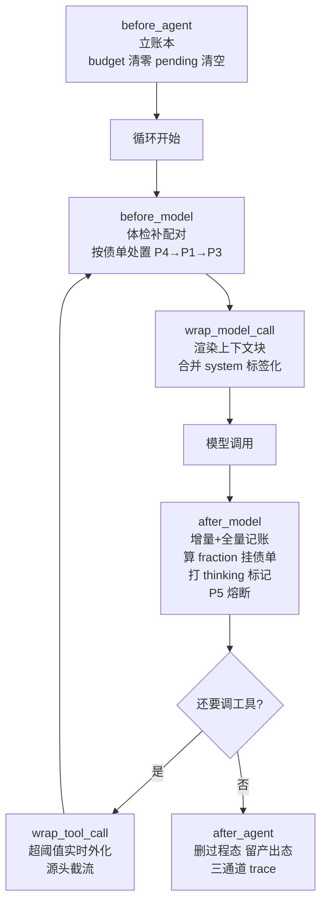

*最终版时间线:每个节点都标注了机制。这一张图,就是全部治理机制的索引。*

一站一站讲:

- **before_agent(立账本)**:为什么在这里?run 开始,一切状态从干净出发,从 checkpointer 恢复上一轮的产出态(summary/快照/指标)。
- **before_model(体检 + 还债)**:为什么在这里?这是处置债务的唯一时机——上一轮记账挂的债单(P1/P4)在这里偿还;体检补配对是每轮例行兜底。检查顺序由重到轻:P4 压缩(有损,做它最降占用)→ P1 外化(无损)→ P3(预留,永不触发)。
- **wrap_model_call(渲染)**:为什么在这里?请求送出去之前,最后的机会把状态渲染成模型看得懂的样子——上下文块、消息标签、合并 system。request-scoped,不持久。
- **after_model(记账 + 熔断)**:为什么在这里?模型刚跑完,usage_metadata 拿到手,账本更新、债单挂出;fraction 过 90% 就当场熔断——这一轮刚犯的险,这一轮就掐掉。
- **wrap_tool_call(实时外化)**:为什么在这里?工具结果产生的源头,大块内容在进 state 之前就搬走——源头截流。
- **after_agent(清场)**:为什么在这里?run 结束,过程态删除、产出态保留,为下一次 run 铺路。

## 10.2 三条底线收拢

治理的所有机制,最终收拢成三条底线:

1. **无损优先**:外化先于压缩;压缩前必快照 + 孤儿外化。证据在第 6、7 章——分级链的顺序本身就是这条底线的体现。
2. **配对不 400**:四道防线层层递进 + 下一轮体检兜底。证据在第 5、7、8 章——从"不切散"到"不产生孤儿"到"剥调用不追加",再到兜底补占位。
3. **状态进 state**:governance 命名空间,跨钩子/跨轮/跨 run。证据在第 2、4、9 章——实例属性做不到并发隔离和持久化。

## 10.3 实现真相总账

学习的目标是代码里的真相。把全文 8 处「实现真相」汇总成一张总账,每条附"如果要修,动哪里":

| 真相 | 现状 | 改造指引 |
|------|------|----------|
| P2 阈值无人消费 | thinking 标记每轮无条件打,与 0.50 阈值无关 | 想让 P2 生效:在 before_model 加 "P2" in pending 检查,按债单决定是否打标记 |
| P3 触发源断链 | 阈值表有 0.60,消费端代码已写好,但记账从不挂 P3 债单 | 启用只需在记账的阈值判定加一行:≥0.60 时挂 P3 |
| 99% 硬停是文案分支 | 无独立硬停钩子,P5 收尾消息按 fraction 换措辞 | 想要真硬停:在 after_model 加 fraction≥0.99 的独立分支 |
| MemorySink 无实现方 | 压缩丢弃消息 → 沉淀记忆的闭环未打通 | 实现 flush 接口 + 在压缩时调用(第 11 章详述) |
| wrap_model_call 空操作 | 契约有 6 钩子,策略只用了 5 个 | 想干预模型请求:实现该钩子消费 request_override |
| "minimal" 静默降级 | 未注册的策略名不报错,只挂公共 2 | 改策略名后确认日志无 "not registered" 警告 |
| _is_externalizable 死代码 | 判定逻辑实际内联在批量外化里 | 想清理:删除方法,把内联判断抽出来 |
| factory 注释笔误 | 注释写"公共 3",实际公共 2 + StrategyMiddleware | 改注释即可,无功能影响 |

## 10.4 自检清单

用"讲给我听"的方式自检,答得出就说明掌握了:

1. 如果 fraction 停在 0.85,每一轮 before_model 会发生什么?(答案:体检补配对;P4 债单在 → 快照 + 压缩,压缩完 P4 债单不再挂;P1 债单可能还在但被抑制门槛挡着;P3 永不触发。)
2. 为什么 P4 检查在 P1 之前,而讲解顺序相反?(处置由重到轻,做最高级的就够;教学由轻到重,认知递进。)
3. 为什么记账在 after_model、处置在下一轮 before_model,而熔断却在 after_model?(工具结果要等下一轮才全量落 state;熔断处置的是本轮刚犯的险,等不起。)
4. 外化为什么无损?压缩为什么有损?为什么压缩前必须快照?(外化搬走、信息还在磁盘;压缩丢失细节;快照是压缩前最后的保全。)
5. 消息配对断裂有哪几种形态?四道防线各防哪种?(跨切点、保留堆孤儿、丢弃孤儿、剥调用产生孤立调用;体检兜底。)
6. 为什么治理状态必须进 ThreadState 而不是策略实例属性?(并发串味、可测试、checkpointer 跨轮持久。)
7. 压缩摘要为什么有两个存放处?模型看到哪个?(消息历史留档 + governance 背包;模型只见 `
` 标签。)
8. 间隔抑制解决什么问题?为什么门槛是"当前 fraction + 10%"?(防振荡;进入/退出阈值错开才稳定。)

**本节源码出处**

本章综合第 2-9 章出处,不重复列出。自检答案对应的机制可回查各章「本节源码出处」。

---

# 第 11 章 治理与记忆的边界:点到为止

五层记忆的完整讲解在阶段 2 下册。本章只回答一个问题:**治理管什么、记忆管什么、交界处有什么缺口。**

## 11.1 边界的两侧

- **治理管"一次 run 的短期窗口"**:窗口是物理约束——模型一次请求能接收多少 token 是硬上限,不治理就 400。治理的产物(摘要、外化文件、快照)服务于"这一次研究任务继续跑下去"。
- **记忆管"跨会话的长期沉淀"**:五层架构(L1 契约 → L2 策略 → L3 存储检索 → L4 中间件 → L5 自动整合)——抽取对话里值得记住的事实,按 Ebbinghaus 衰减管理强度,跨会话检索回灌。它回答的是"下次研究还认不认识你"。

一句话:治理解决"context 会不会爆",记忆解决"爆了之后能不能找回来"——同一枚硬币的两面,但代码里它们是两条独立的管道。

## 11.2 记忆在两个时机的介入

记忆通过两个中间件挂在主循环上,位置都在治理层之后(第 2.1 节的装配顺序):

- **召回(注入)**:before_model,把与当前问题相关的记忆检索出来,以一条 per-call HumanMessage(name=memory_recall,界面隐藏)注入请求——**不进 system prompt**。为什么?记忆内容逐轮变化,如果拼进 system prompt,每轮请求的前缀都不同,prompt cache(按前缀缓存计费)全部失效,是纯成本。注入内容是否计入治理的 token 账本、如何与治理的记账协调,是治理与记忆边界的真实交点,留给下册细说。
- **沉淀(抽取)**:每 N 个用户轮次,把最近的消息提交给后台 worker,异步抽取值得记的 episodic 记忆落库。非阻塞——不在模型调用热路径上做 LLM 抽取。

## 11.3 交界处的缺口

第 7.5 节留了一条线索:压缩丢弃消息前,应该先"冲刷"进长期记忆。契约里定义了接口(MemorySink,压缩策略可调用 flush 把将被丢弃的消息交给记忆层),但**全项目没有任何实现方**——治理压缩目前靠快照 + 外化文件兜底,记忆沉淀这条链路是断的。

这个缺口对改造者意味着两件事:第一,它是现成的练习项目——实现一个 MemorySink,在压缩丢弃前把旧消息提交给记忆 worker,闭环就通了;第二,它是下册的预告——理解了治理的"丢",才能理解记忆的"捞"。

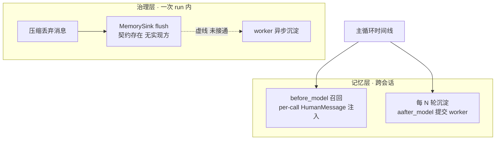

*这张图是治理与记忆的边界:治理的压缩丢弃应该经 MemorySink 沉淀进记忆(虚线,未接通);记忆的召回和沉淀分别挂在主循环的两个时点上。*

**本节源码出处**

- [factory.py:119-141](../poirot/backend/agents/leader/factory.py) —— 记忆两中间件的挂载位置(治理层之后,HelpRequest/ToolCall 之前)
- [contract.py:88-93](../poirot/backend/agents/context_engineering/contract.py) —— MemorySink 契约定义(flush / aflush),全项目无实现方
- 记忆中间件细节留到下册,此处只给目录:[memory_recall_middleware.py](../poirot/backend/agents/middlewares/memory_recall_middleware.py) 与 [memory_consolidation_middleware.py](../poirot/backend/agents/middlewares/memory_consolidation_middleware.py)

---

# 第 12 章 改造入口:从读者到改造者

这是"改造级"目标的兑现章。前 11 章讲机制,这一章讲怎么动手。不列操作清单,讲思路。

## 12.1 换一个策略 bundle,要做四件事

治理策略是可替换的"插头"。换一个自己写的策略,四件事:

1. **实现契约**:写一个类,实现 6 个钩子(不必全用满——DefaultStrategy 的 wrap_model_call 就是空操作,契约允许只用部分钩子)。每个钩子返回 GovernanceResult,想改状态走 state_patch,想改请求走 request_override;
2. **注册**:给类加 `@register_strategy("你的名字")` 装饰器,并在策略包目录的 `__init__.py` 里 import 它——import 触发注册;
3. **改配置**:config 里 `context_governance.strategy` 指向你的名字。**回顾 2.2 节的教训**:名字写错不会报错,是静默降级——改完确认日志里没有 "not registered" 警告;
4. **跑测试**:测试目录 `poirot/backend/tests/v1/unit/context_engineering/` 是你的安全网——现有测试覆盖了记账、策略、执行器的核心契约,跑一遍确认没破坏。

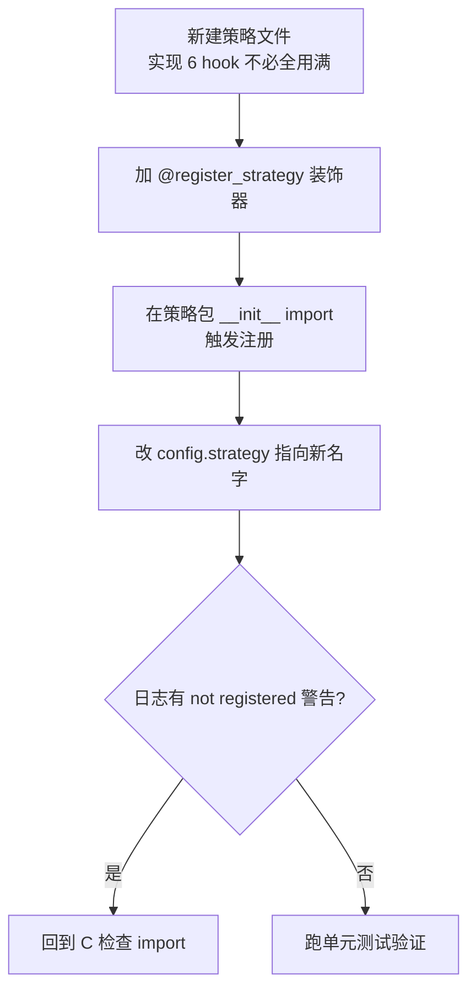

*这张图是换策略的四件事:实现契约 → 装饰注册 → import 触发 → 改配置 → 确认无静默降级警告 → 跑测试。*

为什么这套流程这么顺?因为契约(6 钩子 + 五通道)+ 注册表 + 桥接器三层分离,策略内部完全自由——这正是第 2 章"公共的归公共、可换的归可换"设计兑现的红利。

## 12.2 加一个中间件,挂在哪

如果你想加的不是策略而是中间件(比如监控、注入),阶段 1 已学中间件框架。这里只强调一点:**治理层挂在整条链的最前**。新中间件的挂载位置决定了它和治理的先后关系:想"先治理后注入"(让注入的内容也被治理统计),挂在治理层之后;想"先注入后治理"(注入的内容不占治理的账),挂在治理层之前。装配顺序在 factory 的 `_build_middlewares` 里可见。

## 12.3 调参入口:动了参数会发生什么

策略参数全部通过配置的 `context_governance.params` 传入 DefaultStrategy。参数不多,每个都对应一个机制点:

- **thresholds**:六个分级阈值(p1/p2/p3/p4/p5/hard)。调低 P1 → 更早开始外化;调高 P4 → 更晚才肯有损。改动直接影响分级链的节奏。
- **externalize_dir / snapshot_dir**:外化和快照的落盘目录(默认 .poirot/externalized、.poirot/snapshots)。
- **externalize_min_chars / preview_chars**:外化的长度门槛和预览长度。调低 min_chars → 更多内容被外化(窗口省更多,但模型读回更频繁)。
- **exempt_rounds**:批量外化豁免的最近轮数。调大 → 更保守,只清更旧的账。
- **preserve_recent**:压缩保留的最近消息条数。调大 → 压缩后保留更多原样消息(窗口恢复少,但上下文更完整)。
- **summarize_model**:独立压缩模型名。配一个便宜的模型可以降低压缩成本。
- **window**:显式覆盖窗口大小(测试常用;生产建议留空让系统动态解析真实窗口)。

从哪个参数改起最有安全感?**从门槛开始**:调阈值是"软改动"(只改变触发时机,不改变机制本身),配合 compaction.jsonl 观察触发频率,是最安全的入门实验。这也是学习计划练习 3 的前奏。

**本节源码出处**

- [registry.py:18-32](../poirot/backend/agents/context_engineering/registry.py) —— register_strategy 装饰器(重注册警告)
- [builder.py:20](../poirot/backend/agents/context_engineering/builder.py) —— import strategies 触发注册
- [strategy.py:48-70](../poirot/backend/agents/context_engineering/strategies/default/strategy.py) —— DefaultStrategy 构造:params 到各执行器的映射(thresholds/externalize_dir/min_chars/preview_chars/exempt_rounds/preserve_recent/summarize_model/snapshot_dir)
- [config/schema.py:37-42](../poirot/backend/agents/config/schema.py) —— ContextGovernanceConfig(strategy + params)
- [factory.py:53-86](../poirot/backend/agents/leader/factory.py) —— _build_middlewares 装配顺序(治理层最前)
- 测试目录 [context_engineering/](../poirot/backend/tests/v1/unit/context_engineering/) —— 治理单元测试(安全网)

---

*全文完。下一站:五层记忆(阶段 2 下册)——理解完治理怎么"丢",再去理解记忆怎么"捞"。*
